# Google Antigravity Patch Proxy & Remote 2.0 — Custom LLM Models & Mobile IDE Companion

<p align="center">
  
</p>

<p align="center">
  <a href="package.json"></a>
  <a href="LICENSE"></a>
  <a href="remote/mobile"></a>
  <a href="remote/daemon"></a>
  <a href="src"></a>
  <a href="src/__tests__"></a>
</p>

<p align="center">
  <b>Add custom AI models (Claude 3.5 Sonnet, GPT-4o, DeepSeek R1, Ollama) to Google Antigravity IDE & control everything on your smartphone with Antigravity Remote 2.0.</b>
</p>

> **The complete AI development ecosystem for Google Antigravity:**
> - 🖥️ **Desktop Patch Proxy**: Injects **Anthropic Claude 3.5 Sonnet**, **OpenAI GPT-4o**, **DeepSeek R1 / V3**, **OpenRouter**, **Ollama**, **Google AI Studio**, **Groq**, and **Mistral** directly into the IDE chat and autocomplete dropdowns with AES-256-GCM encryption and bi-directional SSE streaming.
> - 📱 **Antigravity Remote 2.0 (Mobile Companion)**: Native Flutter application (Android APK & iOS) to supervise agent trajectories, review code diffs, approve terminal commands, inspect MCP servers, manage Git worktrees, and chat with AI from anywhere via **Zero-Config LAN Discovery** or **Cloudflare Quick Tunnels**.

---

## 🌟 Visual Showcase & Hero Tour

<div align="center">

| 🖥️ Desktop IDE Custom Models | 📱 Mobile Remote 2.0 Companion |
|:---:|:---:|
|  | 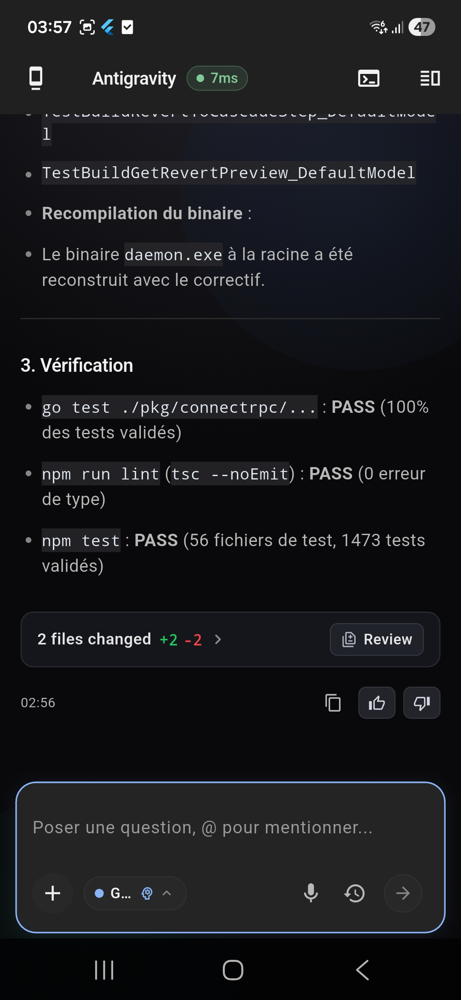 |
| *Native IDE dropdown with custom LLMs & Auto-Fallback* | *Live mobile streaming, 7ms latency, unified diffs & voice input* |

</div>

---

## Table of Contents

- [Overview & Key Capabilities](#overview--key-capabilities)
- [Antigravity Remote 2.0 (Mobile & Daemon Bridge)](#antigravity-remote-20-mobile--daemon-bridge)
  - [Remote Visual Experience & Screen Gallery](#remote-visual-experience--screen-gallery)
  - [Key Remote Capabilities & Protocols](#key-remote-capabilities--protocols)
  - [Running Antigravity Remote](#running-antigravity-remote)
- [Architecture & Reverse Engineering](#architecture--reverse-engineering)
  - [Cloud Code Internal API (`v1internal`)](#cloud-code-internal-api-v1internal)
  - [Language Server Binary Patching](#language-server-binary-patching)
  - [Protobuf Model Injection](#protobuf-model-injection)
  - [Request Lifecycle & Data Flow](#request-lifecycle--data-flow)
- [Desktop UI Screenshots & Custom Models](#desktop-ui-screenshots--custom-models)
- [Key Technical Features](#key-technical-features)
  - [Automated Model Auto-Fallback](#automated-model-auto-fallback--stream-warning-cards)
  - [Format Translators (Claude, OpenAI, Ollama, Gemini)](#format-translators)
  - [Bi-Directional SSE Streaming & Tool Calling](#bi-directional-sse-streaming)
  - [DeepSeek & Claude Thinking Support](#deepseek--claude-thinking-support)
  - [Per-Model Circuit Breaker & Resiliency](#per-model-circuit-breaker--resiliency-circuitbreakerts)
- [Security Architecture & AES-256-GCM](#security-architecture)
- [Quick Start & Installation](#quick-start--installation)
- [`ag-doctor` Diagnostic CLI & UI](#ag-doctor-diagnostic-cli)
- [Supported LLM Providers & Matrix](#provider-configuration-matrix)
- [`custom_models.json` Schema Reference](#custom_modelsjson-schema-reference)
- [Developer Guide & Testing](#developer-guide)
- [Frequently Asked Questions (FAQ)](#frequently-asked-questions-faq)
- [License](#license--acknowledgments)

---

## Overview & Key Capabilities

**Google Antigravity Custom Model Enabler & Remote Ecosystem** transforms your development environment:
1. **Universal LLM Bridge**: Intercepts internal communication between the IDE's Language Server (Go binary) and Google's internal Cloud Code infrastructure (`daily-cloudcode-pa.googleapis.com` → `127.0.0.1:${AG_PROXY_PORT:-51074}`), translating API requests into standard payloads for 19+ LLM providers while preserving tool calls and SSE token streaming.
2. **Mobile IDE Companion**: Connects securely to your IDE session from your smartphone via WebSocket JSON-RPC over local Wi-Fi or Cloudflare Quick Tunnels, giving you real-time human-in-the-loop controls wherever you are.

## Architecture & Reverse Engineering

### Cloud Code Internal API (`v1internal`)

Google Antigravity does not use public Gemini REST endpoints (`v1beta`). Instead, it communicates via internal `v1internal` endpoints:

- `POST /v1internal:fetchAvailableModels` — Fetches active model definitions, quotas, and capabilities.
- `POST /v1internal:streamGenerateContent?alt=sse` — Real-time Server-Sent Event (SSE) chat and code completion stream.
- `POST /v1internal:generateContent` — Non-streaming fallback generation.

The Cloud Code protocol wraps request payloads inside a top-level `request` object:

```json
{
  "project": "antigravity-internal-project",
  "requestId": "req-12345-abcde",
  "request": {
    "contents": [
      {
        "role": "user",
        "parts": [{ "text": "Refactor this function to be async." }]
      }
    ],
    "systemInstruction": {
      "parts": [{ "text": "You are an expert TypeScript developer." }]
    },
    "generationConfig": {
      "temperature": 0.2,
      "maxOutputTokens": 4096
    }
  },
  "model": "custom-claude-3-5-sonnet"
}
```

The local proxy intercepts these calls, extracts `request`, translates roles, system instructions, and tool definitions into the targeted provider format, and re-wraps the output in Google's expected envelope: `{"response": {...}, "traceId": "...", "metadata": {}}`.

### Language Server Binary Patching

Recent Google Antigravity releases hardcode `daily-cloudcode-pa.googleapis.com` inside the Language Server Go binary. To prevent the IDE from bypassing the local proxy:

1. **Binary Patching**: Build scripts patch the compiled binary string tables, replacing Google's hostname with `127.0.0.1:${AG_PROXY_PORT:-51074}`.
2. **Frontend Interception**: `src/main.ts` intercepts and blocks `SetCloudCodeURL` IPC requests from overriding the endpoint dynamically.
3. **URL Padding Handler**: `src/proxy/urlBuilder.ts` strips null/space binary padding from incoming URLs.

### Protobuf Model Injection

To inject custom models into the native IDE model picker:
1. When `fetchAvailableModels` is called, `src/proxy/protoInjector.ts` parses the Google response.
2. `src/proxy/idGenerator.ts` generates DJB2-hash-based IDs (`MODEL_PLACEHOLDER_<hash>`) for each user model.
3. Custom models are dynamically appended to `agentModelSorts` and model arrays so they render natively inside the IDE picker with full feature flags enabled.

### Request Lifecycle & Data Flow

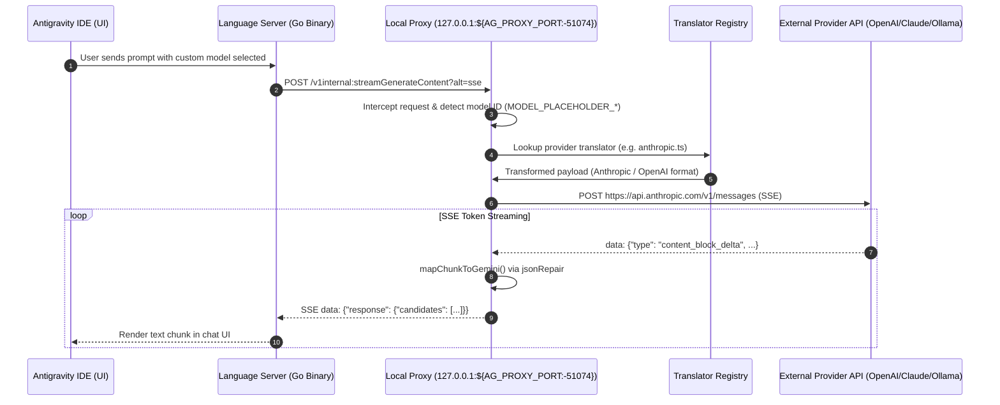

---

## Desktop UI Screenshots & Custom Models

The injected UI seamlessly blends with Antigravity's dark VS Code-adjacent chrome:

| Custom Models Dashboard | Add Model Modal |
|:---:|:---:|
| <br/>*Manage and encrypt custom model endpoints & keys* | <br/>*Configure model names, thinking budget, and context limits* |

| Provider Selection (Claude, OpenAI, DeepSeek, Ollama) | Model Selector in Antigravity Chat UI |
|:---:|:---:|
| <br/>*Preset selector for 19+ popular cloud and local providers* | <br/>*Native IDE model dropdown with custom models injected* |

| Auto-fallback & Failover Stream Notification |
|:---:|
| <br/>*Real-time stream warning notification when failing over to secondary model* |

---

## Key Technical Features

### Automated Model Auto-Fallback & Stream Warning Cards

When a primary model encounters rate limits (`rate_limit` / 429), context length limits, or provider timeouts, the proxy automatically initiates an **Auto-Fallback**:
- **Seamless Failover**: Automatically retries the prompt with a secondary model (e.g. falling back from `MiniMax-M2.7` to `MiniMax-M3` or `Claude-3.5-Sonnet` to `GPT-4o`).
- **Native Stream Warning Card**: Emits an inline markdown warning block (`> ⚠️ Auto-fallback: <model-1> failed (<reason>). Retrying with <model-2>…`) directly into the IDE chat response stream without interrupting the agent's workflow.
- **Context Preservation**: Retains the full conversational history and active tool definitions across the failover boundary.

### Format Translators

The proxy features isolated translator modules under `src/proxy/translators/`:

- **OpenAI Translator (`openai.ts`)**: Full mapping between Gemini `contents`/`parts` and OpenAI `messages`, including tool calls, system prompts, and `usage` token metrics.
- **Anthropic Translator (`anthropic.ts`)**: Handles Claude `system` parameter, `tool_use` blocks, SSE `content_block_start`/`delta` events, and thinking parameter extraction.
- **Google AI Studio Passthrough (`google.ts`)**: Direct passthrough to Google AI Studio keys (`https://generativelanguage.googleapis.com`) with automated model routing.
- **Ollama Translator (`ollama.ts`)**: Compatible with local Ollama, LM Studio, and vLLM servers without requiring API keys.

### Bi-Directional SSE Streaming

- **No Buffering Timeouts**: Streaming requests (`streamGenerateContent`) bypass response buffering and pipe SSE chunks directly to prevent Language Server execution timeouts.
- **Safe JSON Repair (`jsonRepair.ts`)**: Malformed or truncated SSE chunks are parsed and repaired using string-level state machines (`repairPartialJson()`). **Zero use of `eval()` or `new Function()`**.

### Tool Calling & Function Execution

- Converts Gemini `functionDeclarations` to OpenAI `tools` / Anthropic `tool_use`.
- Matches execution responses (`functionResponse`) back to upstream `tool_call_id` tokens across multi-turn sessions using `src/proxy/shared.ts` state storage.

### DeepSeek & Claude Thinking Support

- Detects reasoning parameters (`reasoning_effort`, `thinking`) in `modelUtils.ts`.
- Automatically strips or surfaces reasoning blocks (`<think>...</think>`) depending on IDE capabilities.

### Per-Model Circuit Breaker & Resiliency (`circuitBreaker.ts`)

- **Short-Circuiting Failures**: Automatically trips when an upstream provider experiences persistent errors or timeouts. Prevents the proxy from hanging and keeps the IDE model selection dropdown responsive.
- **Adaptive Retry Budget (`retryBudget.ts`)**: Dynamically adjusts retries per provider based on observed historical reliability. Flaky models receive fewer retries to prevent request storms, while stable models are granted retries.

### Automated Stream Fallback Routing

- **Seamless Provider Redirection**: If a primary custom model returns `429 Rate Limit` or `5xx Server Error`, the proxy automatically reroutes the prompt to an alternate configured fallback model.
- **In-Stream Transparency**: Emits a lightweight markdown notification chunk directly at the top of the chat stream (e.g. `> ⚠️ Auto-fallback: Claude 3.5 Sonnet failed (rate_limit). Retrying with DeepSeek R1...`).

### Telemetry, Metrics & Configuration Exchange

- **Real-Time Latency Metrics (`metrics.ts`)**: Exposes latency distributions (`proxy_upstream_ms`) and error counters (`proxy_errors_total`) via `/metrics`.
- **Config Import / Export (`configExchange.ts`)**: Provides structured JSON export and bulk import for easy model preset sharing across developer teams.
- **Native System Tray Integration (`tray.ts`, `menu.ts`)**: Embedded tray menu providing quick server status, log shortcuts, and toggle controls.


---

## Security Architecture

### AES-256-GCM Encryption (`safeStorage`)

All custom model configurations are stored in `%APPDATA%/antigravity/custom_models.json` (or OS equivalent).

- **Encryption at Rest**: API keys are encrypted using **AES-256-GCM** via Electron `safeStorage` (backed by Windows DPAPI, macOS Keychain, or Linux Secret Service).
- **Auto-Migration**: Upgrades legacy plaintext keys to encrypted payloads (`enc:gcm:...`) seamlessly on first run (`src/proxy/modelLoader.ts`).

### Request Hardening & DoS Protection

- **Request Body Size Cap**: Strict 10 MB payload limit to prevent buffer exhaustion DoS attacks (`HTTP 413 Payload Too Large`).
- **Timeouts**: 30s-120s configurable timeouts on all outbound requests to prevent hung connections.
- **Header Masking**: CSRF tokens and authorization headers are scrubbed from diagnostic logging outputs.

---

## Quick Start & Installation

### Windows Setup

#### One-Click Script
Double-click or run in terminal:
```cmd
repatch.bat
```

#### npm Manual Build
```powershell
npm run build
npm run repatch
```

### macOS & Linux Setup

```bash
# macOS (Extracts /Applications/Antigravity.app, patches, repacks app.asar)
npm run repack:mac

# Linux (Auto-detects installation directory)
npm run repack:linux
```

### Enterprise MITM HTTPS Mode

If your network requires port 443 interception with custom SSL certificates:

```cmd
"Start Antigravity MITM.bat"
```
*(Requires Administrator privileges)*

---

## `ag-doctor` Diagnostic CLI

`ag-doctor` is the built-in diagnostic and maintenance tool provided with this repository.

### Command Reference

```bash
# Run full diagnostic suite (Binary patch status, proxy port, config integrity)
npm run doctor

# Quick health check
npm run doctor:check

# Automated repair (Applies binary patch, fixes corrupt config, resets ports)
npm run doctor:repair

# List active custom models and test API endpoints
npm run doctor:models

# Stream real-time diagnostic logs
npm run doctor:logs

# One-click repatch (IDE or classic, auto-detected): patch + proxy + launch
repatch.bat
```

### Antigravity IDE (v1.107.0+) vs Antigravity 2.0 (Classic)

The ecosystem provides full dual-support for both the classic Electron shell and the VS Code-based Antigravity IDE:

| Dimension | **Antigravity 2.0 (Classic Shell)** | **Antigravity IDE (VS Code)** |
| :--- | :--- | :--- |
| **Installation Path** | `%LOCALAPPDATA%\Programs\antigravity` | `%LOCALAPPDATA%\Programs\Antigravity IDE` |
| **Binary / Core** | v2.9.1 (Proprietary Electron shell) | v1.107.0 (VS Code platform fork) |
| **UI Experience** | Lightweight Agent chat & session management | Full IDE (editor, terminals, git, extensions) |
| **Patch Mechanism** | `app.asar` overlay + `language_server.exe` string table | `jetski.cloudCodeUrl` override + `out/main.js` hook |
| **Proxy Lifecycle** | Internal Electron main process lifecycle | **Autonomous auto-starter** hook in `main.js` |
| **Models Injected** | All custom models in `custom_models.json` | All custom models in `custom_models.json` |

#### Key Capabilities & Architecture:

- **Autonomous Proxy Auto-Starter (`out/main.js`)**: Antigravity IDE automatically verifies if port `51074` is active upon launch. If closed (e.g. Antigravity 2.0 is not running), it immediately spawns the detached background proxy runner from `~/.gemini/antigravity/proxy/` before extension activation, eliminating initial authentication errors (`ECONNREFUSED`).
- **Unified Model Configuration**: Both flavors read from the centralized `~/.gemini/antigravity/custom_models.json` with live health monitoring and auto-fallback.
- **1-Click Launchers**:
  - `Start Antigravity IDE.bat`: Launches Antigravity IDE with guaranteed background proxy execution.
  - `repatch.bat`: One-click repatch and launcher for both classic and IDE installations.
- **`models rekey`**: The language server stores API keys in its own `v10` format that the local proxy cannot decrypt. `ag-doctor models rekey` walks each affected model and re-enters the key in the proxy-compatible format (interactive, or `--keys-file <json>` for batch).

> **Tip**: Add or re-key custom models via `ag-doctor models add` / `models rekey` or `ag-doctor-ui` rather than the IDE's internal settings UI — the IDE re-encrypts keys into its private format, which the proxy cannot read.


### CLI Architecture & Worker Mode

`ag-doctor` runs in two execution modes (`ag-doctor/bin/ag-doctor.js`):
1. **CLI Mode**: One-shot execution for terminal environment checks, model listing, and automated repairs.
2. **Worker Mode (`--worker`)**: Spawns an in-process JSON-RPC daemon via `stdin`/`stdout`, eliminating process spawn overhead for IDE UI queries.

### Visual Diagnostic Dashboard (`ag-doctor-ui`)

In addition to the terminal CLI, this repository includes **`ag-doctor-ui`**, a dedicated Electron UI renderer application:
- **Visual Health Monitors**: Real-time status indicators for port `${AG_PROXY_PORT:-51074}` binding, Language Server binary patches, and SSL certificate validity.
- **One-Click Auto-Repair**: Single button repair flow to un-stick ports, restore corrupt `app.asar` backups, and re-apply version patches.
- **Live Log Inspector**: Integrated log tailing window with real-time severity filters (`INFO`, `WARN`, `ERROR`) and automatic API key masking.

#### Traffic Inspector View (`traffic-inspector.ts`)
- **Real-Time Network Logging**: Intercepts and displays active Cloud Code API requests, HTTP status codes, target models, translated providers, and end-to-end latency benchmarks.
- **Payload Diff & Replay**: Generates visual diff views (`generateDiffView`) for request/response payloads and enables single-click request replaying (`replayEntry`).
- **Multi-Field Filtering**: Filter entries instantly by URL path, model name, provider, or HTTP status code.

#### Failure Scenarios Showcase (`custom-error-scenarios.ts`, `failure-scenario-showcase.ts`)
- **Visual Error Simulation**: Interactive showcase previewing all provider error scenarios (Rate Limits 429, Billing/Quota Overage, Auth Errors 401/403, Network Timeouts, SSL Bypass failures).
- **Native Antigravity Banner Rendering**: Renders full-replica native Antigravity error cards complete with category badges, status tags, decoded troubleshooting hints, and primary/secondary action buttons (`ag-btn-primary`, `ag-btn-dismiss`).
- **Interactive QA Filter Chips**: Filter error cards by scenario category (`Rate Limit`, `Authentication`, `Network`, `Quota`) for visual debugging and QA verification.

### Version-Aware Patching Engine

- **Multi-Version Binary Patching**: `ag-doctor` automatically detects installed Antigravity releases (v2.0.x through v2.6.x) and performs binary string replacement without corrupting Go executable alignment.
- **Backup & Rollback Safety**: Creates timestamped `.bak` copies of `app.asar` before modifying binary payloads, allowing instant 1-command rollbacks (`npm run doctor:repair`).
- **Auto-Healing Diagnostics**: the doctor check starts the emergency proxy stub when port ${AG_PROXY_PORT:-51074} is closed (so the patched language server can initialise), and `proxy start` replaces a stub with the real proxy. Provider probes use a 15s timeout with a retry on timeouts to avoid false "down" alarms.


---

## Antigravity Remote 2.0 (Mobile & Daemon Bridge)

**Antigravity Remote 2.0** extends Google Antigravity IDE and custom LLM models directly to mobile devices (Flutter on Android & iOS). Control agent trajectories, monitor streaming reasoning models, review unified diffs, execute terminal commands, and approve CLI tool actions from anywhere via local Wi-Fi or automated Cloudflare Quick Tunnels.

```
IDE Chat UI ↔ Language Server (Hub :55256) ◄── gRPC-Web ── Daemon Go (:8090 / Cloudflare Tunnel)
                                                                 ▲
                                                                 │ WebSocket (JSON RPC)
                                                                 ▼
                                                    Mobile Client (Flutter App)
```

---

### Remote Visual Experience & Screen Gallery

#### 1. Pairing, Discovery & Quiet Console Welcome
| Zero-Config LAN Discovery & 1-Tap Connect | 6-Digit PIN Pairing & Token Auth | Quiet Console & Action Pills |
|:---:|:---:|:---:|
| 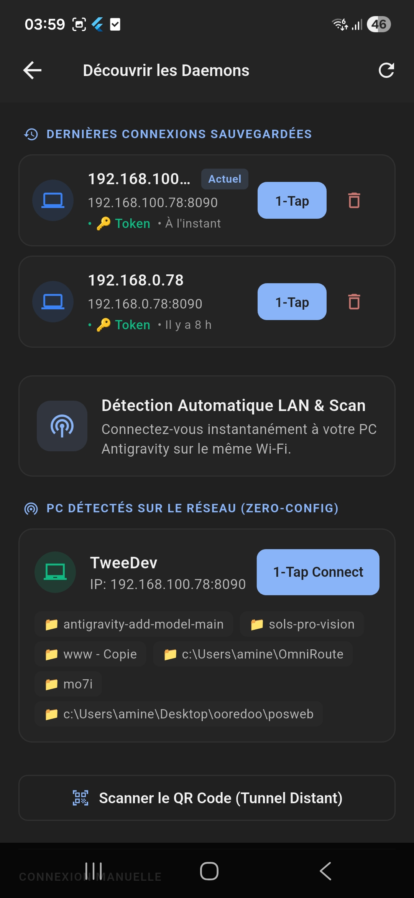 | 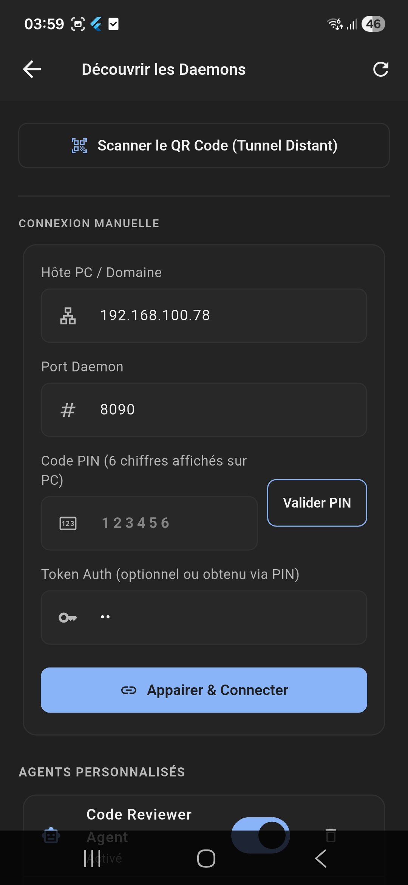 | 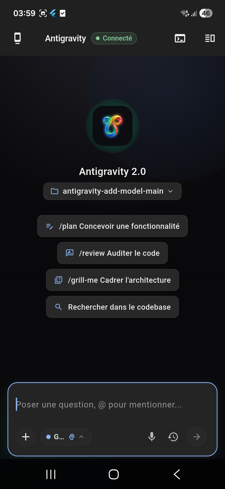 |
| Automatic UDP beacon scan (`:41234`), 1-Tap reconnect & Cloudflare QR scanner | Secure 6-digit rotating PIN validation with token persistence | Antigravity 2.0 glowing logo, prompt suggestions & workspace selector |

#### 2. Streaming Chat, Offline Resilience & Navigation Drawer
| Real-Time Streaming & Quick Actions | Offline Mode & Outbox Queue | Left Navigation & Active Agent State |
|:---:|:---:|:---:|
|  | 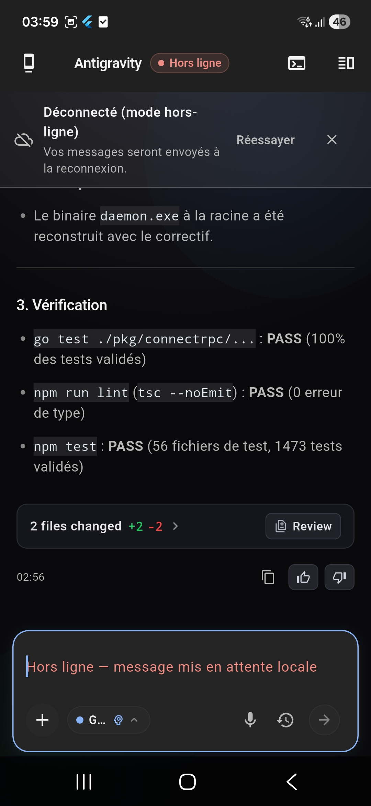 | 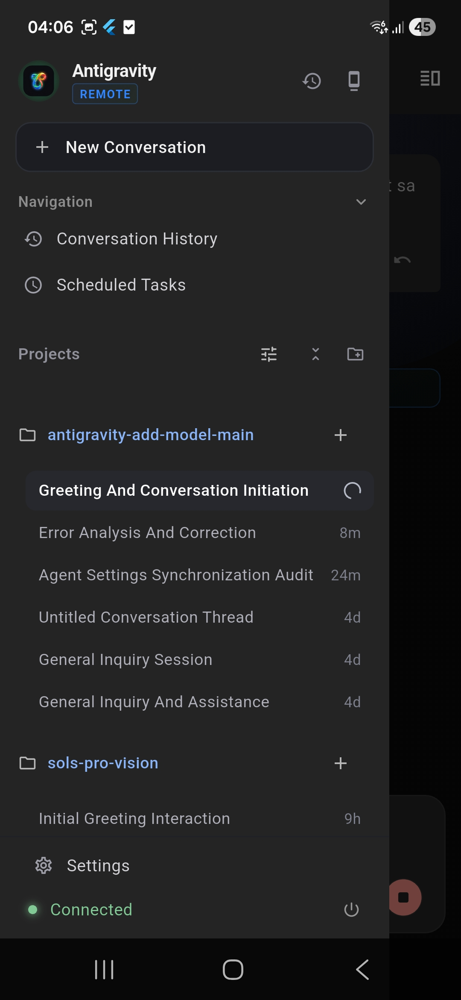 |
| Markdown parsing, 7ms latency badge, diff pills, voice & model switcher | Automatic local queuing and seamless replay on reconnection | Active session spinner, workspace grouping, recent chats & status |

#### 3. Conversation Management & Session Lifecycle
| Conversation History & Search | Session Context Action Sheet | Multi-Project Workspace Switcher |
|:---:|:---:|:---:|
| 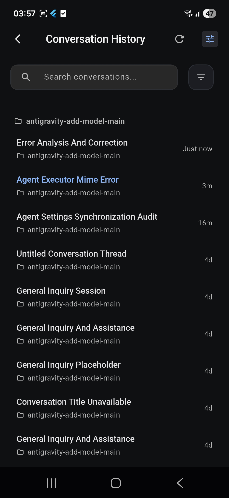 | 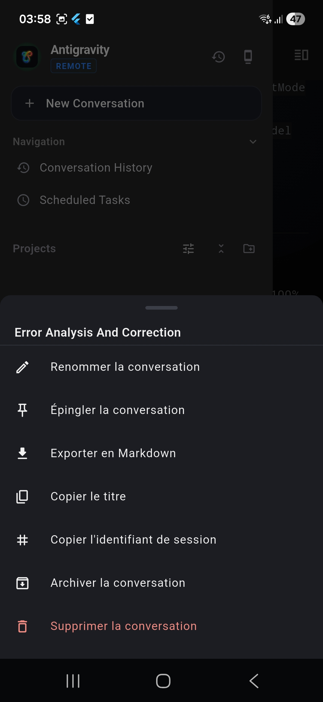 | 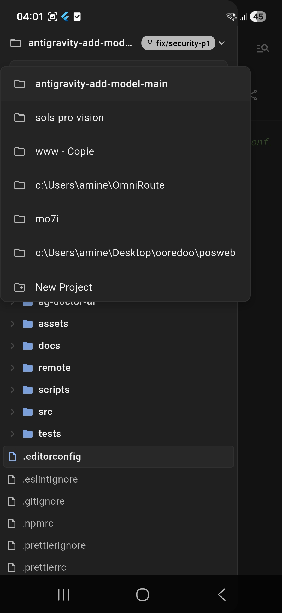 |
| Full-text search across all workspaces with timestamps | Rename, Pin, Export Markdown, Copy ID, Archive, or Delete sessions | Switch active workspace on host PC with instant hot reload |

#### 4. Live Code Review, Artifacts & Multi-Tab Workspace
| Multi-Tab Review & Quota Summary | Session Overview & Subagents | Interactive Artifact Modal |
|:---:|:---:|:---:|
| 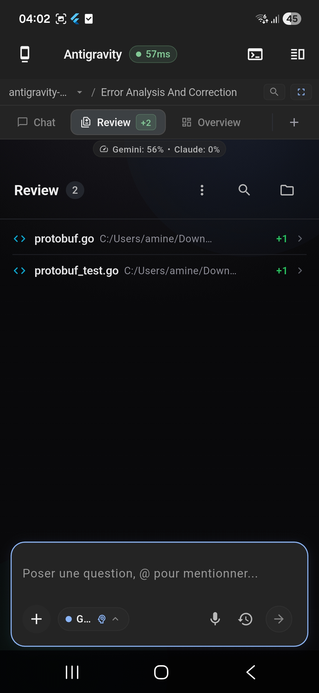 | 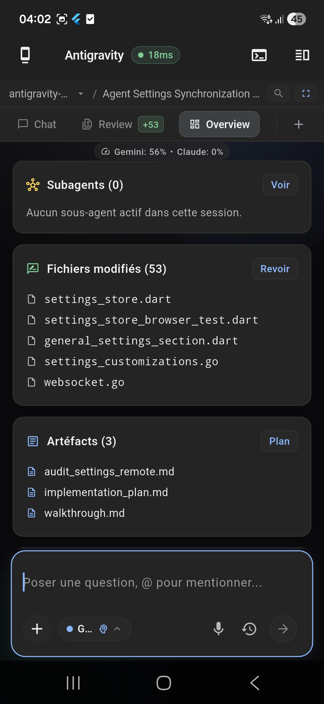 | 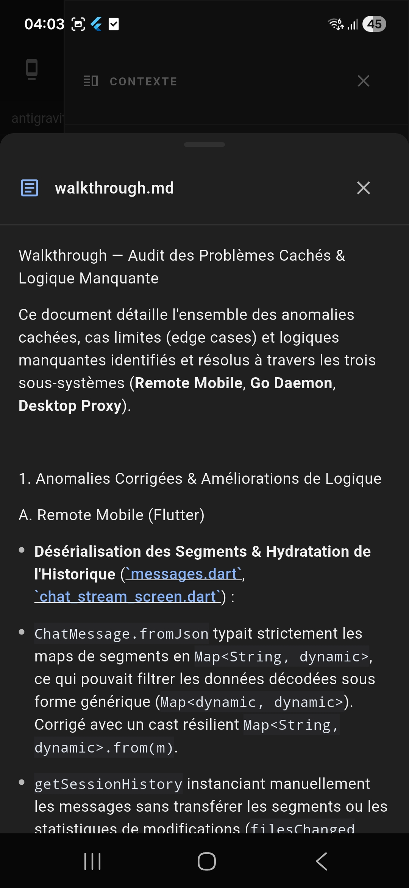 |
| Live unified diff (`protobuf.go (+1)`), Quota badge (`Gemini: 56%`) | Track subagents, 53 modified files, and generated markdown plans | Embedded markdown renderer with clickable file anchors & code blocks |

| Tabbed Artifact Multitasking | Right Context Drawer |
|:---:|:---:|
| 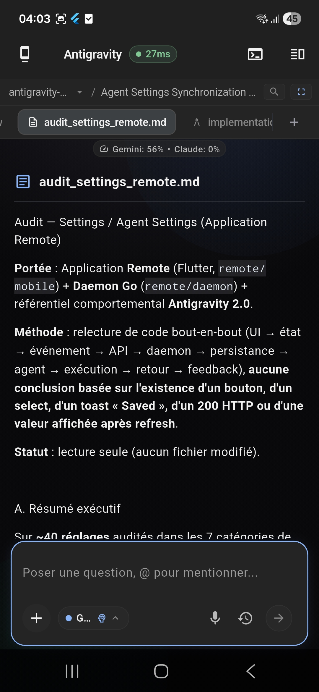 | 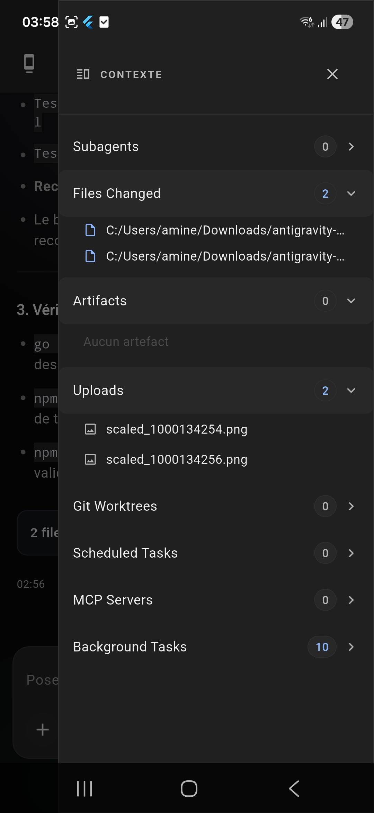 |
| Simultaneous artifact navigation (`audit_settings_remote.md`) and chat input | Quick access to Subagents, Changed Files, Uploads, MCP & Background Tasks |

#### 5. Workspace Explorer, Git Workflows & Remote PTY Terminal
| Workspace File Explorer | Syntax Highlighted Code Viewer | AI-Powered Git Commit Modal |
|:---:|:---:|:---:|
| 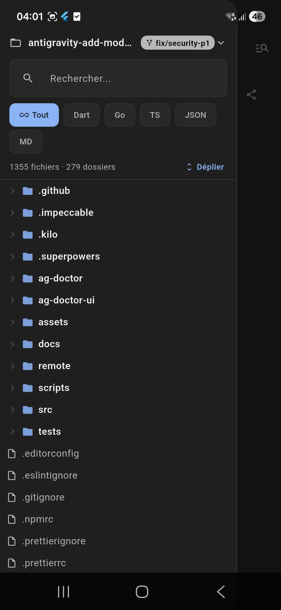 | 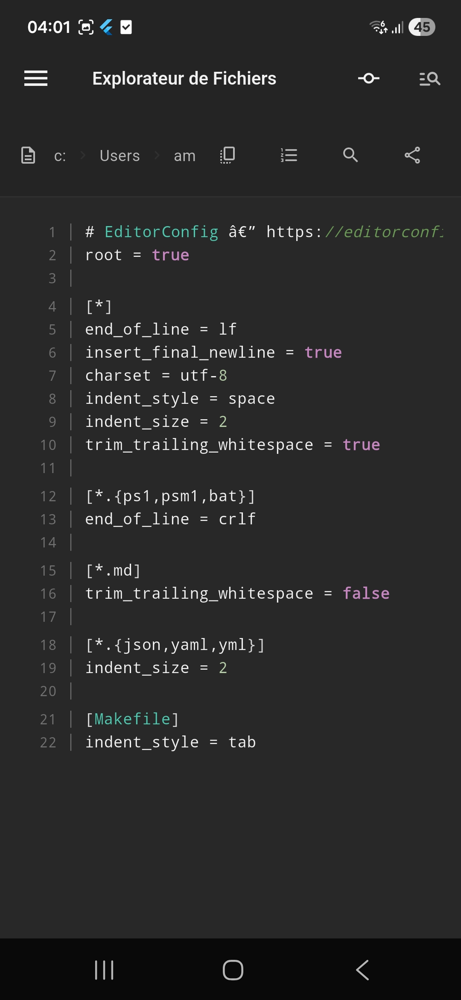 | 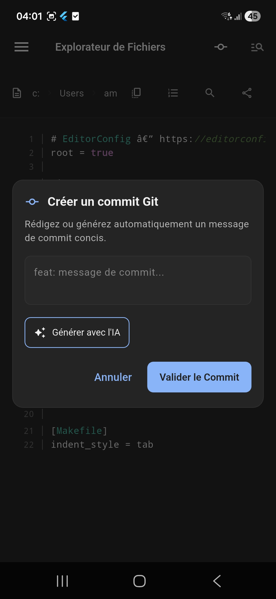 |
| Tree view, branch badge, search, and extension chips (`Dart`, `Go`, `TS`) | Line numbers, syntax highlighting, breadcrumb path & share actions | Generate contextual commit messages with 1-tap AI assistance |

| Git Branch & Worktree Switcher | Embedded Remote PTY Terminal | Scheduled Tasks & Background Cron |
|:---:|:---:|:---:|
| 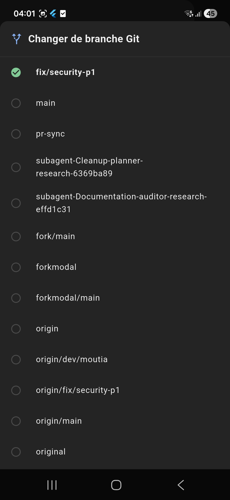 | 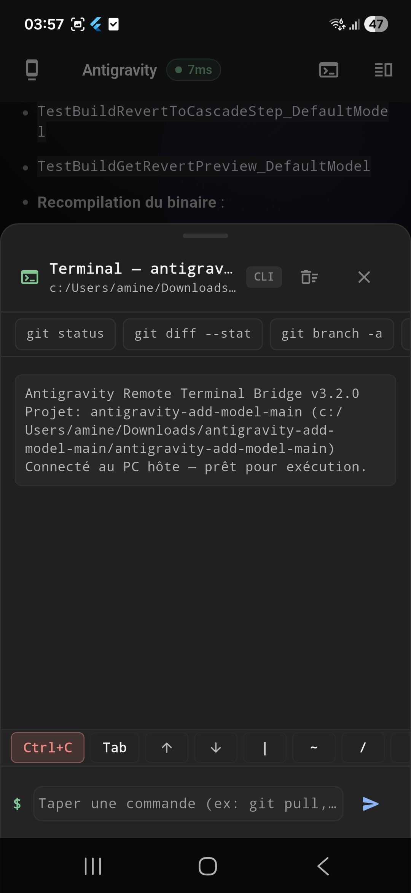 | 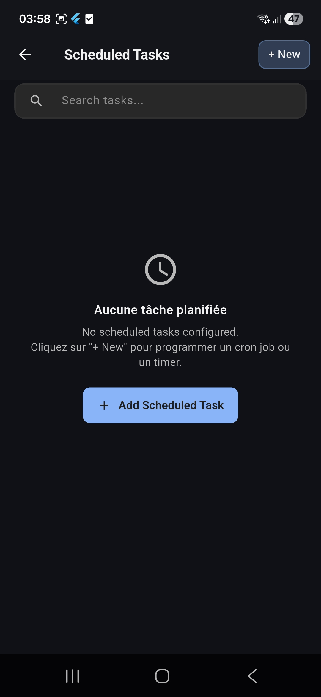 |
| Switch local & remote branches and isolated Git worktrees | Interactive shell bridge with quick action pills (`git status`, `diff`, `branch`) | Cron job scheduler, recurring background task monitors & triggers |

#### 6. 7-Category Modular Settings & Diagnostics
| Modular Settings & Configuration |
|:---:|
| 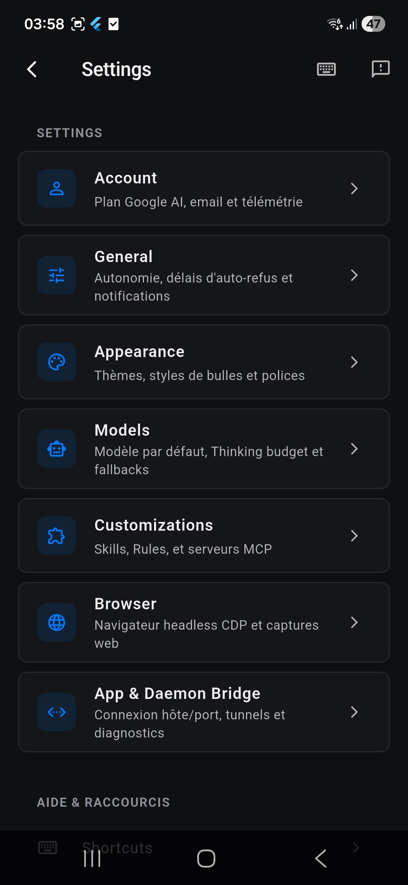 |
| Account, General, Appearance, Models, Customizations (MCP & Skills), Browser (CDP), App & Daemon Bridge |

---

### Key Remote Capabilities & Protocols

1. **Go Daemon Bridge (`remote/daemon`)**:
   - **Process Auto-Discovery**: Automatically locates running `language_server` instances, parses CSRF credentials from process parameters, and maintains connection health via background watchdogs.
   - **gRPC-Web Framing**: Decodes and encodes gRPC-Web Protobuf and Jetbox Connect JSON envelopes transparently.
   - **StepRecovery Buffer**: In-memory ring buffer of the last 100 trajectory frames ensures zero message loss during transient network switches (e.g. Wi-Fi to 5G).
   - **Push Quota Polling**: Monitors Language Server user quota summary every 60s (only while clients are active) and pushes real-time quota updates over WebSocket.

2. **Security & Zero-Config Pairing**:
   - **UDP LAN Discovery**: Broadcasts UDP beacons on port `41234` for instant zero-configuration local network discovery.
   - **6-Digit Rotating PIN & Bearer Tokens**: Authenticate mobile clients using a 60-second rotating PIN displayed on the desktop console.
   - **Cloudflare Quick Tunnels**: 1-click end-to-end encrypted remote access outside local Wi-Fi with ASCII terminal QR code generation.

3. **Interactive Human-in-the-Loop Controls**:
   - **Tool Approvals (`submit_approval`)**: Approve or reject dangerous commands (`run_command`, `write_to_file`) with single-use (`once`) or full-session (`session`) scopes and auto-rejection timeouts.
   - **Structured Question Answering (`AskQuestion`)**: Interactive radio button and multi-select cards for resolving agent forks directly from phone notifications.
   - **Colosseum Battle Arena**: Multi-model duel supervision (e.g. Claude 3.5 Sonnet vs Gemini 2.0 Flash) with side-by-side branch comparison.

4. **Offline-First Resilience & Outbox Queue**:
   - **Optimistic UI & Local Outbox**: Messages composed while disconnected are stored in local FIFO storage and automatically drained upon reconnection.
   - **Zero Duplicate Deliveries**: UUID-based request mapping and message deduplication prevent repeated prompts.

---

### 📥 Download Pre-built Binaries (Android APK & Daemons)

Pre-built binaries are automatically built and published via GitHub Actions for every release:

| Component | Platform / Architecture | Asset Name | Description |
|---|---|---|---|
| **Android App (Universal)** | Android 7.0+ (ARM64, ARMv7, x86_64) | `antigravity-remote-universal.apk` | Single APK for all Android devices |
| **Android App (Split ABI)** | Android 64-bit ARM (`arm64-v8a`) | `app-arm64-v8a-release.apk` | Lightweight optimized APK (~25MB) |
| **Android App Bundle** | Google Play Store Format | `app-release.aab` | Official signed App Bundle |
| **Daemon Bridge** | Windows (`x86_64`) | `antigravity-remote-daemon-windows-amd64.exe` | Windows standalone daemon binary |
| **Daemon Bridge** | Linux (`x86_64`) | `antigravity-remote-daemon-linux-amd64` | Linux headless server daemon |
| **Daemon Bridge** | macOS Apple Silicon (`arm64`) | `antigravity-remote-daemon-darwin-arm64` | macOS M1/M2/M3 native binary |

### Running Antigravity Remote

```bash
# 1. Start the Remote Daemon on host PC (with Cloudflare tunnel & token)
cd remote/daemon
go run main.go --port 8090 --tunnel cloudflare --auth-token mysecret

# Or run pre-built daemon binary directly:
./antigravity-remote-daemon-windows-amd64.exe --tunnel cloudflare

# 2. Run the Flutter Mobile Companion App (or install the release APK)
cd remote/mobile
flutter run -d <device-id>
```

---

## Provider Configuration Matrix

| Provider | Preset Slug | Target Base URL | Key Required | Streaming | Tool Calling |
|---|---|---|---|---|---|
| **OpenAI** | `openai` | `https://api.openai.com/v1` | Yes | Yes | Yes |
| **Anthropic** | `anthropic` | `https://api.anthropic.com/v1` | Yes | Yes | Yes |
| **OpenRouter** | `openrouter` | `https://openrouter.ai/api/v1` | Yes | Yes | Yes |
| **Google AI Studio** | `google` | `https://generativelanguage.googleapis.com` | Yes | Yes | Yes |
| **Ollama** | `ollama` | `http://localhost:11434` | No | Yes | Yes |
| **DeepSeek** | `openai` | `https://api.deepseek.com/v1` | Yes | Yes | Yes |
| **Groq** | `openai` | `https://api.groq.com/openai/v1` | Yes | Yes | Yes |
| **Mistral AI** | `openai` | `https://api.mistral.ai/v1` | Yes | Yes | Yes |
| **Together API** | `openai` | `https://api.together.xyz/v1` | Yes | Yes | Yes |
| **LM Studio** | `openai` | `http://localhost:1234/v1` | No | Yes | Yes |
| **vLLM / LocalAI** | `openai` | Custom Endpoint | Optional | Yes | Yes |

---

## `custom_models.json` Schema Reference

Configurations are saved under `%APPDATA%/antigravity/custom_models.json`:

```json
[
  {
    "id": "custom-claude-3-5-sonnet",
    "name": "Claude 3.5 Sonnet",
    "provider": "anthropic",
    "model": "claude-3-5-sonnet-20241022",
    "apiKey": "enc:gcm:...",
    "baseUrl": "https://api.anthropic.com/v1",
    "parameters": {
      "temperature": 0.7,
      "topP": 0.9,
      "maxTokens": 4096,
      "customSystemPrompt": "Focus on high-performance clean code."
    },
    "retry": {
      "maxRetries": 3,
      "timeoutMs": 60000
    }
  }
]
```

---

## Developer Guide

### Codebase Structure

```
├── ag-doctor/             # Diagnostic CLI suite & worker daemon
├── scripts/               # Repack, deploy, and MITM launcher scripts
├── src/
│   ├── constants.ts       # Central source of truth (Providers, default ports, timeouts)
│   ├── cryptoStore.ts     # AES-256-GCM encryption wrapper
│   ├── main.ts            # Electron main process interceptors
│   ├── preload.ts         # Injected Custom Models Settings UI
│   ├── ipcHandlers.ts     # IPC storage & connection test handlers
│   ├── proxy/
│   │   ├── proxy.ts       # Core HTTP proxy server orchestration
│   │   ├── registry.ts    # Translator auto-discovery registry
│   │   ├── protoInjector.ts # Protobuf payload injection
│   │   ├── jsonRepair.ts  # Safe non-eval SSE JSON repair
│   │   ├── retryStrategy.ts # Exponential backoff retry logic
│   │   └── translators/   # OpenAI, Anthropic, Google, Ollama translators
│   └── __tests__/         # 1455 unit tests (Vitest)
```

### Building & Watch Mode

```bash
# Compile TypeScript files (src/ -> dist/)
npm run build

# Watch mode for iterative code changes
npm run watch
```

### Running Tests

The test suite runs via **Vitest**:

```bash
# Run all 1455 unit tests
npm test

# Run tests in watch mode
npm run test:watch
```

### Adding a New Translator Module

To add support for a new LLM provider format:
1. Create `src/proxy/translators/<provider>.ts`.
2. Implement and export:
   ```typescript
   export function mapGeminiTo<Provider>(body: any, modelName: string): any;
   export function map<Provider>ToGemini(res: any, modelName: string): any;
   export function map<Provider>ChunkToGemini(chunk: any, modelName: string): any;
   ```
3. Add the provider definition to `PROVIDERS` in [src/constants.ts](src/constants.ts).

---

## Troubleshooting & Diagnostics

| Symptom | Cause | Solution |
|---|---|---|
| Models missing from chat dropdown | IDE update overwrote `app.asar` | Run `npm run doctor:repair` or `repatch.bat` |
| Connection test failed (401/403) | Invalid or expired API Key | Check key in Settings or `npm run doctor:models` |
| `${AG_PROXY_PORT:-51074}` in use | Another proxy instance active | `ag-doctor` automatically picks fallback port |
| `ERR_HTTP_HEADERS_SENT` in logs | Upstream response race condition | Handled automatically by `safeWriteHead` helpers |
| SSL / Certificate error | Corporate proxy SSL interception | Enable MITM mode via `"Start Antigravity MITM.bat"` |

Full troubleshooting guides are detailed in [TROUBLESHOOTING.md](TROUBLESHOOTING.md).

---

## Frequently Asked Questions (FAQ)

### How do I add Anthropic Claude 3.5 Sonnet or DeepSeek R1 to Google Antigravity IDE?
You can add Claude 3.5 Sonnet, DeepSeek R1, OpenAI GPT-4o, or any custom LLM model by opening the custom model settings modal in Google Antigravity IDE, entering your API key and provider base URL, and running the automatic patcher (`repatch.bat` on Windows or `npm run repack:mac` on macOS).

### Are my provider API keys secure?
Yes. All custom model configurations and API keys are stored locally and encrypted at rest using **AES-256-GCM** via Electron `safeStorage` (backed by Windows DPAPI, macOS Keychain, or Linux Secret Service). Keys are never sent to third-party tracking servers.

### Can I run local LLMs with Ollama or LM Studio in Google Antigravity?
Yes. Set the provider to `ollama` or `openai` with endpoint `http://localhost:11434` (Ollama) or `http://localhost:1234/v1` (LM Studio). No API keys are required for offline local inference.

### How does auto-fallback and failover work?
If a primary custom model returns a `429 Rate Limit`, quota overage, or timeout, the proxy automatically retries the prompt with your configured secondary fallback model and renders a native warning banner in the chat stream without breaking conversation history.

---

## GitHub Search & Topics Metadata

For maximum repository discoverability on GitHub Search and Google SERP, ensure the following repository topics are assigned under **GitHub Repository Settings > About**:

`google-antigravity` • `antigravity-ide` • `custom-models` • `claude-3-5-sonnet` • `deepseek-r1` • `openai-gpt4o` • `ollama` • `openrouter` • `llm-proxy` • `cloudcode-patch`

---

## License & Acknowledgments

- **License**: Distributed under the **Apache-2.0 License**. See [LICENSE](LICENSE) for details.
- **Original Repository & Credits**: Special thanks to **Abdulvahap OGUT** for the original project repository: [vahapogut/antigravity-add-model](https://github.com/vahapogut/antigravity-add-model).
