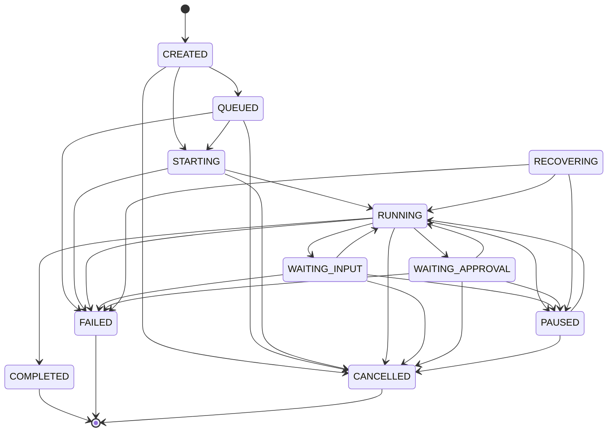

# Remote Agent Runtime — Domain Model & FSM

## 1. Overview

The **Remote Agent Runtime** (`ag-agentd`) shifts the execution boundary of Antigravity from client-side IDEs to persistent remote environments (VPS, dedicated cloud instances). 

Clients (Desktop Electron IDE, Mobile Flutter, Web) act strictly as observation and interaction surfaces. The remote server owns:
1. **Server Metadata & Capabilities**
2. **Workspaces** (Git repositories, local paths, virtual environments)
3. **Sessions & State Machine (FSM)**
4. **Durable Event Log & Snapshots**

---

## 2. Entities

### `Server`
Represents the remote agent daemon instance.
```json
{
  "id": "srv_vps_prod_01",
  "name": "Cloud Agent VPS",
  "hostname": "ubuntu-s-2vcpu-4gb",
  "platform": "linux",
  "version": "2.0.0",
  "status": "ONLINE",
  "createdAt": "2026-09-06T05:00:00Z",
  "updatedAt": "2026-09-06T05:00:00Z"
}
```

### `Workspace`
Represents an isolated directory or project repository managed on the server.
```json
{
  "id": "ws_antigravity_core",
  "serverId": "srv_vps_prod_01",
  "name": "antigravity-core",
  "path": "/home/agent/workspace/antigravity-core",
  "repoUrl": "git@github.com:org/repo.git",
  "branch": "main",
  "createdAt": "2026-09-06T05:00:00Z",
  "updatedAt": "2026-09-06T05:00:00Z"
}
```

### `Session`
Represents an autonomous agent execution lifecycle.
```json
{
  "id": "sess_1757134000_abc123",
  "serverId": "srv_vps_prod_01",
  "workspaceId": "ws_antigravity_core",
  "title": "Refactor auth middleware",
  "state": "RUNNING",
  "lastSequence": 42,
  "createdAt": "2026-09-06T05:01:00Z",
  "updatedAt": "2026-09-06T05:05:00Z"
}
```

---

## 3. Finite State Machine (FSM)



### Allowed Transitions Matrix
- **`CREATED`**: Can transition to `QUEUED`, `STARTING`, `CANCELLED`.
- **`QUEUED`**: Can transition to `STARTING`, `CANCELLED`, `FAILED`.
- **`STARTING`**: Can transition to `RUNNING`, `FAILED`, `CANCELLED`.
- **`RUNNING`**: Can transition to `WAITING_INPUT`, `WAITING_APPROVAL`, `PAUSED`, `COMPLETED`, `FAILED`, `CANCELLED`.
- **`WAITING_INPUT`**: Can transition to `RUNNING`, `PAUSED`, `CANCELLED`, `FAILED`.
- **`WAITING_APPROVAL`**: Can transition to `RUNNING`, `PAUSED`, `CANCELLED`, `FAILED`.
- **`PAUSED`**: Can transition to `RUNNING`, `CANCELLED`.
- **`RECOVERING`**: Can transition to `RUNNING`, `PAUSED`, `FAILED`.
- **Terminal States (`COMPLETED`, `FAILED`, `CANCELLED`)**: Immutable sink states. Any further state transition is strictly rejected with `ErrInvalidTransition`.

---

## 4. State Invariants
1. **Single Active Transition**: All state transitions are protected under session mutex locks and written atomically to the SQLite database.
2. **Auditability**: Every transition automatically appends a corresponding `session.state_changed` event with `from`, `to`, and `reason`.
3. **Autonomous Execution**: Disconnecting clients has **zero** effect on session state. The server continues executing in `RUNNING` state until a decision point (`WAITING_APPROVAL`, `WAITING_INPUT`, `COMPLETED`, `FAILED`) is reached.
