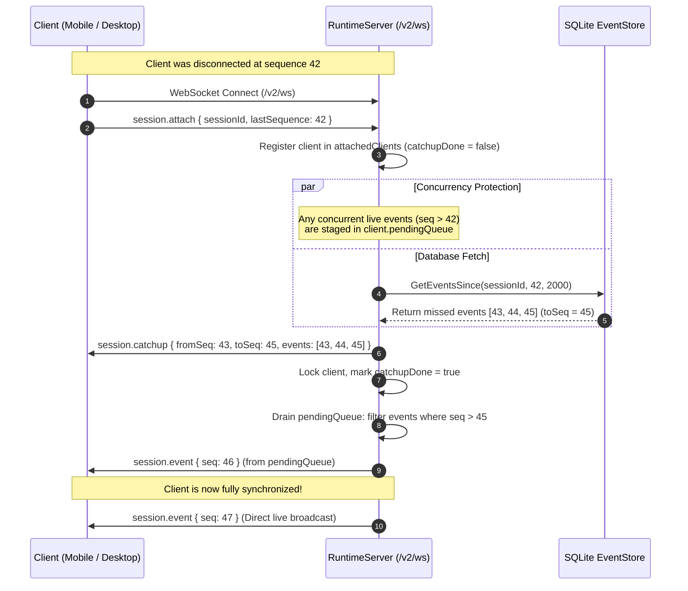

# Disconnect Resilience & Event Replay

## 1. Zero-Loss Guarantee

In real-world mobile and remote workflows, network interruptions are frequent:
- Phone screens lock, pausing background WebSockets.
- WiFi transitions to 5G / cellular data.
- Cloudflare / Pinggy / SSH tunnels drop and reconnect.

The Remote Agent Server Runtime guarantees **zero lost events** and **zero duplicate events** across disconnections of arbitrary duration.

---

## 2. Reconnection Sequence

---

## 3. Staging Queue Algorithm

To prevent the classic catchup vs. live broadcast race condition where an event might be missed or duplicated:
1. When a client attaches, it is marked with `catchupDone = false` and allocated an empty `pendingQueue []domain.Event`.
2. Any live event emitted while `catchupDone == false` is appended to `pendingQueue`.
3. The store queries all events `> lastSequence` up to `toSeq`.
4. `session.catchup` is sent over the wire containing `events` up to `toSeq`.
5. Under client lock, `catchupDone` is set to `true`, and all items in `pendingQueue` with `Sequence > toSeq` are immediately flushed to the client.
6. `pendingQueue` is deallocated.
7. Future events stream directly to the client.

---

## 4. Autonomous Offline Execution

When all clients disconnect:
1. `AttachedCount(sessionId)` drops to 0.
2. The agent loop continues running uninterrupted.
3. All stdout/stderr, tool calls, and LLM completions continue appending to the SQLite Event Store.
4. When a user opens their phone or laptop hours later, the client simply transmits its last known sequence number and receives an instant catchup replay.
