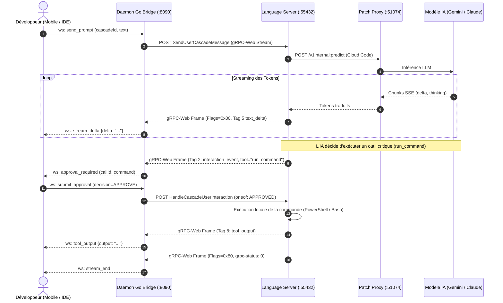

# 🌊 Spécification Complète du Protocole de Streaming : Antigravity IDE

> **Référence d'Ingénierie Réseau & Protocoles Temps Réel**  
> Ce document définit de manière exhaustive **l'intégralité des 8 canaux de streaming gRPC-Web et WebSocket**, le cadrage binaire, la gestion des oneofs, le flux de pensées (thinking), les interactions asynchrones et la résilience réseau (StepRecovery buffer).

---

## 1. Vue d'Ensemble des Canaux de Streaming

Antigravity IDE utilise **8 flux de streaming bidirectionnels ou unidirectionnels** exposés par `LanguageServerService` :

```
┌─────────────────────────────────────────────────────────────────────────────┐
│                       CANAUX DE STREAMING LANGAGE SERVER                    │
├────────────────────────────────┬──────────────┬─────────────────────────────┤
│ Méthode RPC Stream             │ Direction    │ Rôle Principal              │
├────────────────────────────────┼──────────────┼─────────────────────────────┤
│ 1. SendUserCascadeMessage      │ Server Stream│ Prompt + Tokens + Outils    │
│ 2. JetboxSubscribeToSummaries  │ Server Stream│ Statuts de toutes les sess. │
│ 3. JetboxSubscribeToState      │ Server Stream│ État global du panneau      │
│ 4. StreamAgentStateUpdates     │ Server Stream│ Sous-agents & tâches de fond│
│ 5. StreamCascadeReactiveUpdates│ Server Stream│ Statut d'exécution (RunStat)│
│ 6. StreamTerminalOutput        │ Server Stream│ PTY Terminal stdout/stderr  │
│ 7. StreamSearchCode            │ Server Stream│ Résultats recherche vector. │
│ 8. StreamAudioTranscription    │ Bidirectionnel│ Dictée vocale temps réel   │
└────────────────────────────────┴──────────────┴─────────────────────────────┘
```

---

## 2. Cadrage Binaire Wire Format (gRPC-Web)

Chaque fragment réseau reçu sur la connexion HTTP/1.1 ou HTTP/2 est encapsulé avec un en-tête de 5 octets :

```text
 0                   1                   2                   3
 0 1 2 3 4 5 6 7 8 9 0 1 2 3 4 5 6 7 8 9 0 1 2 3 4 5 6 7 8 9 0 1
+-+-+-+-+-+-+-+-+-+-+-+-+-+-+-+-+-+-+-+-+-+-+-+-+-+-+-+-+-+-+-+-+
|     FLAGS     |                  LENGTH (L)                   |
|   (1 octet)   |              (4 octets Big-Endian)            |
+-+-+-+-+-+-+-+-+-+-+-+-+-+-+-+-+-+-+-+-+-+-+-+-+-+-+-+-+-+-+-+-+
|                                                               |
+                        PAYLOAD PROTOBUF                       +
|                           (L octets)                          |
+-+-+-+-+-+-+-+-+-+-+-+-+-+-+-+-+-+-+-+-+-+-+-+-+-+-+-+-+-+-+-+-+
```

### Table des Flags d'En-tête
- **`0x00` (`Data Frame`)** : Le payload de `L` octets est un message Protobuf sérialisé.
- **`0x01` (`Compressed Data Frame`)** : Le payload est compressé (Gzip / Deflate).
- **`0x80` (`Trailer Frame`)** : Trame finale contenant les métadonnées gRPC (`grpc-status: 0`, `grpc-message`, tokens consommés).

---

## 3. Décodage Forensique du Stream Principal : `SendUserCascadeMessage`

### A. Format du Message de Requête (`SendUserCascadeMessageRequest`)

```protobuf
message SendUserCascadeMessageRequest {
  string cascade_id = 1;                     // UUID de la session
  string text = 2;                           // Texte du prompt
  codeium_common_pb.Metadata metadata = 3;   // APIKey + SessionID
  CascadeConfig cascade_config = 4;          // Modèle demandé & mode planner
  repeated MediaAttachment media = 6;        // Images base64 / documents
  bool is_continuation = 7;                  // Poursuite d'un tour existant
  uint32 parent_step_index = 8;              // Index de l'étape parente
}
```

---

### B. Format des Trames de Réponse (`SendUserCascadeMessageResponse`)

| Tag Protobuf | Wire Type | Nom du Champ | Description & Rôle |
|:---:|:---:|:---|:---|
| **Field 1** | WireType 2 (Length-delimited) | `cascade_id` | Identifiant de la session cible (`UUID`). |
| **Field 2** | WireType 2 (Length-delimited) | `interaction_event` | Événement d'interaction (demande d'approbation d'outil ou question). |
| **Field 3** | WireType 0 (Varint) | `step_index` | Numéro séquentiel de l'étape en cours de génération (`0, 1, 2...`). |
| **Field 5** | WireType 2 (Length-delimited) | `text_delta` | Fragment de texte généré par l'IA (Markdown). |
| **Field 6** | WireType 2 (Length-delimited) | `thought_delta` | Raisonnement interne de l'agent (Thinking Process). |
| **Field 7** | WireType 2 (Length-delimited) | `tool_call_start` | Début d'un appel d'outil (nom, arguments partiels). |
| **Field 8** | WireType 2 (Length-delimited) | `tool_call_output` | Sortie d'exécution d'un outil (`stdout`, `stderr`). |
| **Field 9** | WireType 0 (Varint) | `status` | Énumération du statut d'exécution (`CascadeRunStatus`). |
| **Field 10** | WireType 2 (Length-delimited) | `error` | Détail d'une erreur d'inférence si status = ERROR. |

---

## 4. Diagramme de Séquence : Streaming & Approbation Asynchrone



---

## 5. Résilience Réseau & Buffer `StepRecovery`

1. **Anneau Circulaire en Mémoire** : Le Daemon Go conserve en mémoire un anneau de **200 trames par session**.
2. **Déconnexion & Rattrapage (`sync_catchup`)** :
   Si le smartphone se déconnecte pendant 45 secondes lors d'une longue génération, le client mobile envoie son dernier `lastSeenSequence` lors de la reconnexion.
3. Le Daemon diffuse alors les trames manquées sous forme de paquet groupé `sync_catchup` sans aucune perte d'informations.
