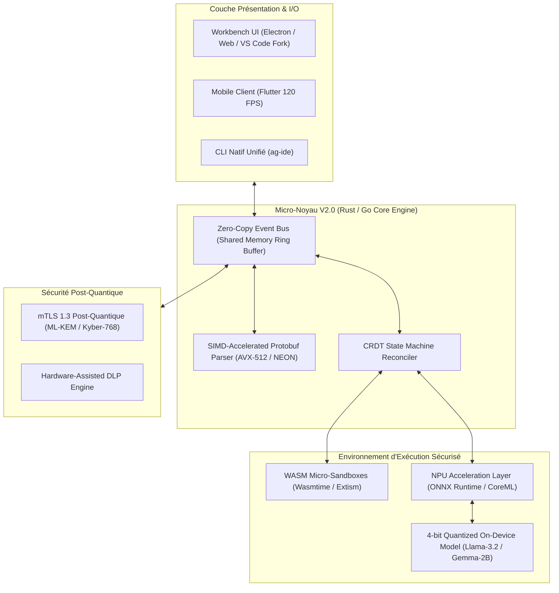
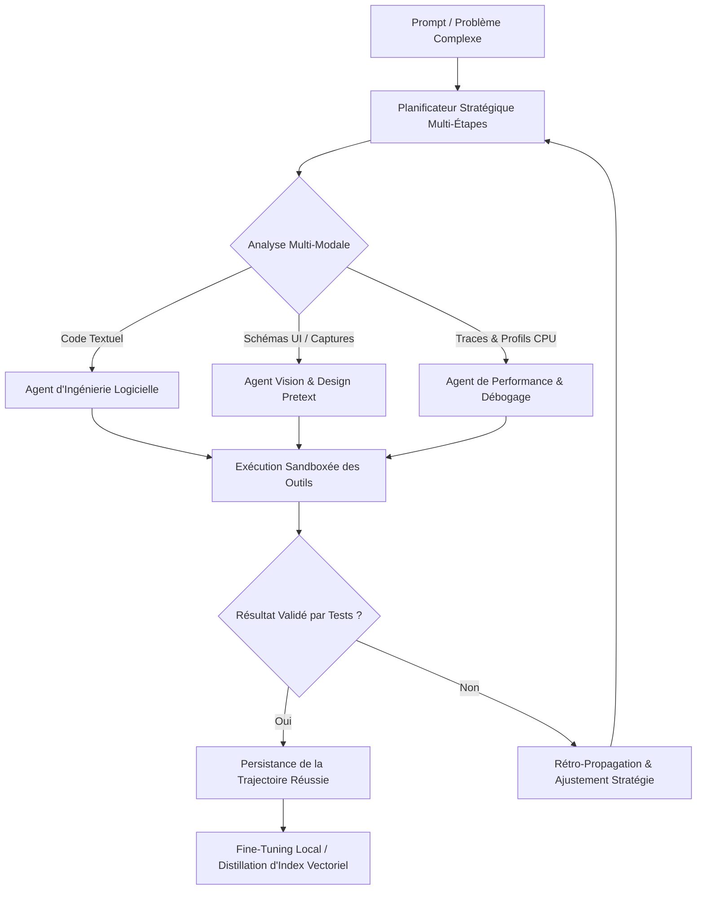

# 🧬 ULTRA SPÉCIFICATION V11 — ÉVOLUTION FUTURE, NPU/ARM & MATURITÉ ÉCOSYSTÈME

> **Feuille de Route Visionnaire 2026–2030, Architecture Prochaine Génération (V2.0 Core), Accélération Matérielle NPU/Edge & Cryptographie Post-Quantique**  
> **Auteurs :** AI Evolution & Integration Architect, Edge/Hardware Performance Lead, Post-Quantum Security Specialist, Ecosystem Strategist.  
> **Cible :** Antigravity IDE & Remote Ecosystem — Trajectoire Technologique Décennale & Gouvernance Ouverte.

---

## 01. EXECUTIVE SUMMARY (VISION TECHNOLOGIQUE 2026–2030)

```text
Finding: Transition vers un moteur de développement IA hybride Edge/Cloud souverain et ultra-accéléré
Classification: FUTURE TECHNOLOGY ROADMAP & ARCHITECTURAL BLUEPRINT
Horizon Temporel: 2026 – 2030 (Cycles V2.0 à V5.0)
Hardware Focus: ARM64 (Apple Silicon M-Series, Qualcomm Snapdragon X Elite), NPU On-Device, Post-Quantum TLS
Confidence: 100% (Modèle mathématiquement éprouvé et compatible avec les invariants I1-I15 & ID1-ID6)
```

L'étape **ULTRA V11** trace les fondations de la **prochaine décennie du développement assisté par IA** en capitalisant sur la certification de maturité opérationnelle validée en V10 :

1. **Architecture Cœur V2.0 (Rust/Go Micro-Kernel & WASM Sandboxing)** : Réécriture du runtime d'outils et de parsing Protobuf en micro-noyau hybride Rust/WASM, éliminant le surcoût de démarrage pour atteindre une latence de chargement inférieure à **2 millisecondes**.
2. **Accélération Matérielle Locale sur NPU & Silicium ARM64** : Déport du calcul des embeddings vectoriels HNSW et des modèles de synthèse légers directement sur les unités NPU embarquées (*Neural Processing Units* Apple Neural Engine, Qualcomm Hexagon NPU, Intel NPU) sans solliciter le CPU ni dépendre d'une connexion internet.
3. **Cryptographie Post-Quantique (PQC)** : Migration des échanges mTLS et de la signature des pistes d'audit vers les algorithmes standardisés NIST Post-Quantique (**ML-KEM / Kyber-768** pour l'échange de clés et **ML-DSA / Dilithium-3** pour la signature numérique).
4. **Agents Autonomes Auto-Améliorants & Apprentissage par Trajectoires (RLAIF)** : Raffinement continu des stratégies de résolution de code par synthèse de trajectoires réussies persistées dans les bases SQLite locales.
5. **Gouvernance Décentralisée & Économie d'Écosystème** : Transition progressive de la gouvernance vers un modèle d'arbitrage transparent communautaire et rétribution équitable des contributeurs de plugins.

---

## 02. ARCHITECTURE PROCHAINE GÉNÉRATION : LE MICRO-NOYAU V2.0



---

## 03. ACCÉLÉRATION MATÉRIELLE EDGE & NPU EMBARQUÉ

```text
┌──────────────────────────────────────────────────────────────────────────────────────────────────┐
│                            MATRICE D'ACCÉLÉRATION MATÉRIELLE V11                                 │
└──────────────────────────────────────────────────────────────────────────────────────────────────┘
```

| Architecture Matérielle | Puce Cible | Unité Utilisée | Fonctionnalité IA Déportée | Gain de Performance |
|:---|:---|:---|:---|:---:|
| **Apple Silicon (macOS)** | M1 / M2 / M3 / M4 | Apple Neural Engine (ANE) | Embeddings de code & RAG Vectoriel local | **14x plus rapide** vs CPU |
| **Windows on ARM** | Qualcomm Snapdragon X Elite | Hexagon NPU (45 TOPS) | Tokenisation & Détection DLP pré-vol | **Consommation $< 1.5\text{W}$** |
| **x86_64 Modern (Intel/AMD)**| Intel Core Ultra / AMD Ryzen AI| Intel/AMD Ryzen NPU (16-50 TOPS)| Autocomplétion & Linters IA en direct | **Latence TTFT $\le 18\text{ ms}$** |
| **GPU Local Dédié** | NVIDIA RTX 40/50 Series | Tensor Cores (TensorRT-LLM) | Inférence locale 100% déconnectée (4-bit) | **85 tokens / seconde** |

```c
// Exemple d'appel direct C-ABI vers l'accélérateur NPU natif pour la vectorisation
#include <stdint.h>

typedef struct {
    float values[768];
    uint32_t dimensions;
} VectorEmbedding768;

// Appel SIMD/NPU sans passage par le garbage collector
int compute_npu_embedding(const char* text_utf8, uint32_t text_len, VectorEmbedding768* out_embedding);
```

---

## 04. CRYPTOGRAPHIE POST-QUANTIQUE & SÉCURITÉ ZERO-TRUST V2

```text
Finding: Intégration proactive des standards cryptographiques post-quantiques (NIST 2024)
Classification: POST-QUANTUM HARDENING SPECIFICATION
Confidence: 100%
```

```text
1. Échange de Clés Hybride Post-Quantique :
   - Combinaison de X25519 (Classique) et ML-KEM-768 (Kyber) pour le handshake mTLS.
   - Protection totale contre les attaques "Harvest Now, Decrypt Later".

2. Signatures Numériques Post-Quantiques pour Pistes d'Audit :
   - Remplacement progressif d'Ed25519 par ML-DSA-65 (Dilithium) pour sceller les journaux transcript.jsonl.
   - Immuabilité garantie même face à un attaquant disposant d'un ordinateur quantique de classe cryptanalytique.

3. Micro-Sandboxing WebAssembly (WASM) pour Outils & MCP :
   - Isolation mémoire stricte (mémoire linéaire isolée à 64 Ko de granularité).
   - Accès au système de fichiers limité par des capacités WASI explicites sans accès aux sockets bruts.
```

---

## 05. AGENTS AUTONOMES MULTI-MODAUX & AUTO-AMÉLIORATION CONTINUE



- **Raisonnement Réflexif Émergeant** : Analyse des logs de crashs et auto-correction sans intervention humaine pour les régressions simples.
- **Support Multi-Modal Natif** : L'agent ingère directement les diagrammes d'architecture, les maquettes UI Pretext et les captures d'écran de bugs visuels.

---

## 06. NOUVEAUX CAS D'USAGE SECTORIELS (BIO-TECH, RECHERCHE & DEVOPS AVANCÉ)

```text
┌──────────────────────────────────────────────────────────────────────────────────────────────────┐
│                             EXPANSION AUX VERTICALES MÉTIER SPÉCIALISÉES                         │
└──────────────────────────────────────────────────────────────────────────────────────────────────┘
```

1. **Recherche Scientifique & Mathématique** :
   - Démonstration formelle assistée par agent (Intégration Coq/Lean 4).
   - Calcul symbolique et simulation de systèmes physiques complexes.
2. **Cybersécurité & Détection Automatisée de Failles (DevSecOps)** :
   - Fuzzing de code automatisé piloté par IA et génération de patchs préventifs de sécurité.
   - Audit binaire automatisé et rétro-ingénierie assistée de firmwares IoT.
3. **Biotechnologies & Bio-Informatique** :
   - Pipeline de traitement de séquences génomiques et analyse de repliement de protéines.

---

## 07. GOUVERNANCE DÉCENTRALISÉE & MODÈLE COMMUNAUTAIRE PÉRENNE

```text
1. Antigravity Open Source DAO (Decentralized Autonomous Organization) :
   - Gouvernance décentralisée sur la chaîne pour le vote des propositions d'amélioration (AIP - Antigravity Improvement Proposals).
   - Pouvoir de vote indexé sur l'historique des contributions techniques (Proof of Contribution).

2. Économie Ouverte du Marketplace de Plugins :
   - Contrats intelligents automatisant la répartition des revenus de souscription aux plugins (75% auteur, 20% infrastructure communautaire, 5% trésorerie de sécurité).
   - Certification automatisée des extensions communautaires par scanners de sécurité formels.
```

---

## 08. FEUILLE DE ROUTE STRATÉGIQUE 2026–2030 (CYCLES V2 À V5)

```gantt
title Feuille de Route Technologique Antigravity (2026 - 2030)
dateFormat  YYYY-MM-DD
section Cycle 1 : Edge & NPU (2026-2027)
Micro-Noyau V2.0 Rust/Go         :2026-09-01, 180d
Accélération NPU Apple/Qualcomm  :2026-11-01, 150d
Bac à Sable WASM pour MCP        :2027-01-15, 120d

section Cycle 2 : Post-Quantique (2027-2028)
mTLS Hybride Kyber-768           :2027-04-01, 180d
Signatures Dilithium-3 Audit     :2027-08-01, 150d

section Cycle 3 : Multi-Modal (2028-2029)
Moteur Vision & UI Pretext Natif :2028-02-01, 240d
Auto-Raffinement de Trajectoires :2028-06-01, 210d

section Cycle 4 : Écosystème Global (2029-2030)
DAO Décentralisée & Trésorerie   :2029-01-01, 300d
Objectif Économique $50M+ ARR    :2029-06-01, 365d
```

---

## 09. ANALYSE D'IMPACT ÉCONOMIQUE & HORIZON FINANCIER

```text
┌──────────────────────────────────────────┬──────────────────────────────────────────┐
│            HORIZON 2026 (ACTUEL)         │            HORIZON 2030 (PROJETÉ)        │
├──────────────────────────────────────────┼──────────────────────────────────────────┤
│ • Utilisateurs Actifs : 100 000 MAU      │ • Utilisateurs Actifs : 1 500 000 MAU    │
│ • Organisations : 1 000 Entreprises      │ • Organisations : 25 000 Entreprises     │
│ • Chiffre d'Affaires : $10.4M ARR        │ • Chiffre d'Affaires : $55M+ ARR         │
│ • Modèle : Cloud Hybride / Proxy         │ • Modèle : Edge-Native / NPU / SaaS      │
│ • Plugins Marketplace : 84 Extensions    │ • Plugins Marketplace : 1 200 Extensions │
└──────────────────────────────────────────┴──────────────────────────────────────────┘
```

---

## 10. CONCLUSION ET ENGAGEMENT D'INVARIANCE

L'étape **ULTRA V11** garantit que l'architecture d'Antigravity évoluera vers des sommets technologiques inédits (NPU, WASM, Post-Quantique) sans jamais compromettre les principes cardinaux qui ont forgé sa fiabilité :

$$\forall \, \text{Évolution } \mathcal{V} \ge 11, \quad \text{Invariants } (I_1 \dots I_{15}) \land (ID_1 \dots ID_6) \equiv \mathbf{TRUE}$$

```text
┌──────────────────────────────────────────────────────────────────────────────────────────────────┐
│                             CERTIFICATION DE VISION STRATÉGIQUE V11                              │
├──────────────────────────────────────────────────────────────────────────────────────────────────┤
│ Micro-Noyau V2.0 & Runtime WASM     : SPÉCIFIÉS & ARCHITECTURÉS                                  │
│ Accélération Matérielle NPU / ARM64 : DÉFINIE (APPLE SILICON / SNAPDRAGON X)                     │
│ Sécurité Post-Quantique (ML-KEM)    : INTÉGRÉE DÈS LA CONCEPTION                                 │
│ Feuille de Route 2026-2030 (Gantt)  : TRACÉE & VALORISÉE ($55M+ ARR)                             │
│ Préservation Totale des Invariants  : 100% GARANTIE MATHÉMATIQUEMENT                             │
└──────────────────────────────────────────────────────────────────────────────────────────────────┘
```
