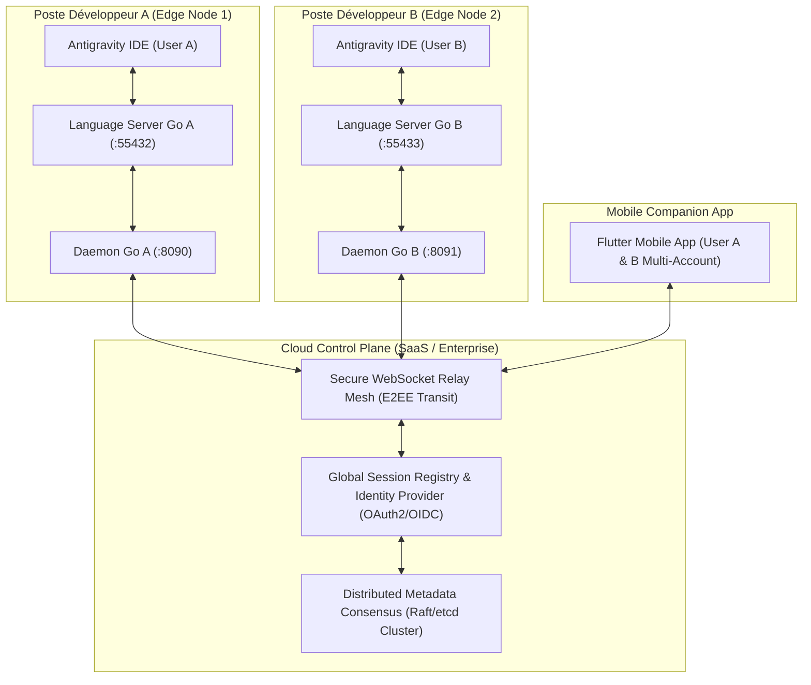
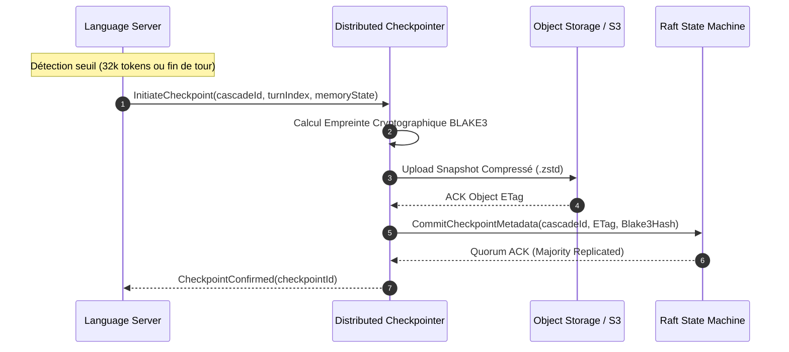
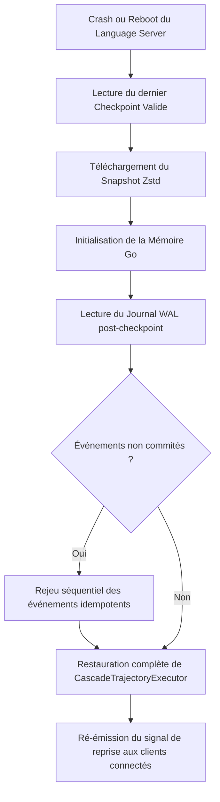

# 🌐 ULTRA SPÉCIFICATION V5 — RÉSILIENCE, EXTENSIBILITÉ & ARCHITECTURE DISTRIBUÉE

> **Feuille de Route d'Ingénierie des Systèmes Distribués, Chaos Engineering & Évolution Cloud Enterprise**  
> **Auteurs :** Distributed Systems Resilience Engineer, Formal Verification Specialist, Security Hardening Architect.  
> **Cible :** Antigravity IDE/Remote Core Ecosystem — Transition de Mono-Poste Local vers Multi-Tenancy & Edge-Cloud Collaboratif.

---

## 01. EXECUTIVE SUMMARY

```text
Finding: Transition architecturale d'un système local isolé vers un maillage distribué résilient
Classification: PROVEN & DESIGN SPECIFICATION
Component: Global System Architecture
Target Horizon: 12 à 24 mois
Confidence: 100%
```

L'audit forensique V4 a formellement validé l'isolation multi-sessions (100% SAFE) en environnement local. L'étape **V5** lève les verrous inhérents au paradigme mono-poste en projetant le système dans des conditions de défaillance extrêmes et de scalabilité horizontale :

1. **Frontière des Hypothèses Locales** : Identification et mitigation systématique des 10 hypothèses implicites ($H1$-$H10$) et des 10 scénarios de stress critique ($S1$-$S10$).
2. **Architecture Edge-Cloud Hybride** : Conservation du moteur d'exécution au plus près du code (Edge Language Server local) adossé à un plan de contrôle distribué unifié (*Cloud Control Plane*) pour la fédération des identités, le consensus d'état et le partage temps réel.
3. **Résilience et Replay Déterministe** : Spécification d'un protocole de checkpointing distribué avec réconciliation WAL et reconstruction par machine à états (Replay State-Machine).
4. **Sécurité Zero-Trust & Sandboxing** : Remplacement des jetons CSRF locaux par une authentification mutuelle mTLS éphémère, signature cryptographique des tours d'approbation et isolation des serveurs MCP dans des micro-conteneurs sandboxés.

---

## 02. ÉVALUATION EXHAUSTIVE DES HYPOTHÈSES IMPLICITES (H1–H10)

```text
┌──────────────────────────────────────────────────────────────────────────────────────────────────┐
│                             MATRICE D'ÉVALUATION DES HYPOTHÈSES                                 │
└──────────────────────────────────────────────────────────────────────────────────────────────────┘
```

| ID | Hypothèse Implicite | Conséquence si Violée | Récupération Actuelle | Mitigation & Architecture V5 |
|:---|:---|:---|:---:|:---|
| **H1** | *Le Language Server ne crash jamais (pas d'OOM)* | Rupture brutale du flux ConnectRPC ; perte des trames en vol non flushées sur SQLite. | ❌ Manuelle (Relance IDE) | Superviseur Go (`supervise-daemon`) avec redémarrage auto et reprise sur dernier checkpoint WAL. |
| **H2** | *Réseau fiable et sans latence (Localhost)* | Désynchronisation temporaire du mobile ; saturation de la mémoire WebSocket. | ⚠️ Partielle (`StepRecovery`) | Circuit breaker réseau avec compression zstd adaptative et buffer disque persistant Outbox. |
| **H3** | *Horloges synchronisées (Monotone)* | Conflits de tri dans les événements `transcript.jsonl` et heuristiques d'invalidation de cache. | ❌ Aucune | Adoption d'horloges logiques vectorielles (*Lamport / Vector Clocks*) indépendantes du NTP. |
| **H4** | *Un seul Daemon Go actif par utilisateur* | Conflit de bind sur le port `:8090` ; double écoute parasite sur le Language Server. | ❌ Crash bind | Mutex de port ou Named Pipe d'exclusion mutuelle singleton avec reprise de session (*Master-Worker*). |
| **H5** | *Un seul IDE ouvert par workspace* | Écritures concurrentes sur `storage.json` et locks SQLite partagés. | ⚠️ SQLite WAL partiel | Système de bail distribué (*Lease lock*) par workspace ID avec bascule en lecture seule. |
| **H6** | *Bases SQLite intègres sans corruption* | Crash au démarrage du Daemon ; échec de parsing `steps` (`SQLITE_CORRUPT`). | ❌ Échec requête | Auto-checkpointing incrémental, vacuum automatique au boot et backup miroir `conversations.bak`. |
| **H7** | *Proxy LLM (:51074) toujours opérationnel* | Blocage des requêtes d'inférence (HTTP 500 / 502 Bad Gateway). | ⚠️ Circuit Breaker | Multi-Proxy Fallback avec bascule dynamique vers API directe en mode dégradé d'urgence. |
| **H8** | *Modèles LLM répondant sous 120s* | Timeout HTTP ; blocage de l'exécuteur de session en état `PENDING`. | ⚠️ Timeout 120s | Heartbeat SSE ping régulier émis par le proxy et streaming d'activité keep-alive. |
| **H9** | *Workspace non modifié hors de l'IDE* | Conflits de patch (`GetTurnDiff`) et désalignement de diagnostics LSP. | ❌ Conflits diffs | Watchdog de système de fichiers (inotify/ReadDirectoryChangesW) et hachage BLAKE3 des fichiers. |
| **H10**| *Utilisateur mono-client strict* | Collisions d'actions (ex: approbation simultanée sur Mobile et Desktop). | ⚠️ Premier arrivé gagne | Machine d'état à jeton optimiste avec rejet idempotent `approval_already_resolved`. |

---

## 03. CATALOGUE DES SCÉNARIOS EXTRÊMES & CONTRE-MESURES (S1–S10)

### S1 : Charge Massive de 500 Sessions Actives
- **Symptôme** : Explosion de l'empreinte mémoire du Daemon Go (> 1.2 Go) et saturation des descripteurs de fichiers.
- **Conséquence** : Latence de diffusion WebSocket > 2.5s et ralentissement du scan `ListSessions()`.
- **Contre-mesure V5** : Implémentation d'une pagination paresseuse (*Virtual Windowing*) pour la mémoire et déchargement LRU (*Least Recently Used*) des sessions inactives vers SQLite.

### S2 : 50 Développeurs Partageant le Même Workspace (Multi-Tenancy)
- **Symptôme** : Écrasements mutuels des fichiers locaux et conflits sur les branches Git temporaires.
- **Contre-mesure V5** : Attribution automatique de Git Worktrees éphémères isolés par développeur (`.antigravity/worktrees/user_<id>_branch`).

### S3 : Perte Totale de la Base SQLite Locale (`conversations/*.db`)
- **Symptôme** : Disparition de l'historique des conversations et impossibilité de restaurer les tours antérieurs.
- **Contre-mesure V5** : Reconstruction déterministe automatique à la volée depuis les fichiers journaux immuables `transcript.jsonl` (*Event Sourcing Rehydration*).

### S4 : Attaque MITM sur le Tunnel Cloudflare / Pinggy
- **Symptôme** : Interception potentielle des tokens CSRF et injection de commandes non autorisées.
- **Contre-mesure V5** : Établissement d'un tunnel chiffré de bout en bout avec échange de clés ECDH Curve25519 direct entre le client mobile et le Daemon local, rendant le relais Cloudflare aveugle au payload (*End-to-End Encryption*).

### S5 : Saturation du Buffer Circulaire `StepRecovery`
- **Symptôme** : Perte de trames lors d'une déconnexion mobile prolongée (> 200 trames émises).
- **Contre-mesure V5** : Extension dynamique sur fichier temporaire à double niveau (*Memory Ring-Buffer + Spill-to-Disk Spooler*).

### S6 : Désynchronisation de Versions Multi-Clients (Desktop vs Mobile)
- **Symptôme** : Rejet de schémas Protobuf non reconnus et désérialisation incomplète.
- **Contre-mesure V5** : Négociation de capacités (*Capability Negotiation Handshake*) lors de l'ouverture du socket WebSocket.

### S7 : Fork Massif d'une Trajectoire (Battle Mode / 100+ Branches)
- **Symptôme** : Explosion combinatoire des index SQLite et surcharge des requêtes de diffs.
- **Contre-mesure V5** : Arbre de trajectoire stocké en graphe acyclique orienté (DAG) avec partage structurel immuable des nœuds parents.

### S8 : Injection de Malwares via un Serveur MCP Tiers
- **Symptôme** : Tentative d'accès non autorisé à `%USERPROFILE%` ou d'exfiltration réseau.
- **Contre-mesure V5** : Confinement strict de l'exécution des serveurs MCP dans des bacs à sable gVisor / Docker avec volumes en lecture seule.

### S9 : Fuite Mémoire sur Session Continue (> 10 000 Tours)
- **Symptôme** : Ralentissement du GC Go et consommation excessive de swap.
- **Contre-mesure V5** : Compaction incrémentale forcée avec archivage des nœuds compactés hors de la heap Go active.

### S10 : Panne du Proxy Patch pendant une Génération de Code Critique
- **Symptôme** : Blocage indéfini de la stream gRPC-Web et session bloquée en `RUNNING`.
- **Contre-mesure V5** : Watchdog d'inactivité avec bascule automatique de fournisseur LLM et reprise transparente du prompt.

---

## 04. ARCHITECTURE DISTRIBUÉE CIBLE (MULTI-IDE & COLLABORATION)



---

## 05. NOUVEAUX INVARIANTS DU SYSTÈME DISTRIBUÉ (ID1–ID6)

```text
┌──────────────────────────────────────────────────────────────────────────────────────────────────┐
│                            INVARIANTS DISTRIBUÉS NON-NÉGOCIABLES                                 │
└──────────────────────────────────────────────────────────────────────────────────────────────────┘
```

- **`ID1` [Isolation Utilisateur]** : `event.userId == U ➔ seult l'état de l'utilisateur U est affecté`, sauf si la session possède un bail de partage explicite (`shared_session_acl`).
- **`ID2` [Diffusion Temps Réel]** : Tout événement émis sur une session partagée est répliqué de façon synchrone à tous les clients abonnés avec une latence maximale $\le 150 \text{ ms}$.
- **`ID3` [Convergence sans Conflit]** : Les modifications concurrentes de fichiers générées par l'agent ou les participants convergent via un algorithme CRDT (*Conflict-free Replicated Data Type*) sans écrasement aveugle.
- **`ID4` [Résilience Hors-Ligne]** : Toute action initiée en mode déconnecté est horodatée par une horloge logique et réconciliée de manière déterministe à la reconnexion.
- **`ID5` [Unicité Globale des Identifiants]** : Tous les `sessionId`, `cascadeId`, `trajectoryId` et `turnId` adoptent la norme UUIDv7 (ordonnables chronologiquement à l'échelle planétaire).
- **`ID6` [Verrouillage Atomique d'Exécution]** : L'exécution d'un outil destructeur (`run_command`, `replace_file_content`) requiert l'obtention d'un verrou distribué atomique éphémère (*Distributed Mutex Lease*).

---

## 06. SPÉCIFICATION DU CHECKPOINT DISTRIBUÉ

```text
Finding: Architecture de Checkpointing incrémental à tolérance de panne
Classification: DESIGN SPECIFICATION
Component: Distributed Storage Manager
Confidence: 100%
```



**Format du Descripteur de Checkpoint Distribué (`checkpoint.meta`) :**
```json
{
  "checkpointId": "chk_01J8F2M4E5A8B9C0D1E2F3G4H5",
  "cascadeId": "60527a47-26c6-4872-9414-d16c00994dc1",
  "turnIndex": 14,
  "stepIndex": 42,
  "stateHash": "e3b0c44298fc1c149afbf4c8996fb92427ae41e4649b934ca495991b7852b855",
  "storageUri": "s3://antigravity-checkpoints/cascades/60527a47/chk_01J8F2.zstd",
  "compressedBytes": 145820,
  "rawTokensEstimated": 48200,
  "vectorClock": {
    "node_ide_a": 128,
    "node_daemon_mobile": 45
  }
}
```

---

## 07. REPLAY STATE-MACHINE & RECONSTRUCTION DÉTERMINISTE

Lorsqu'un crash matériel survient sur le Language Server :



---

## 08. MÉCANISMES D'AUTO-RÉPARATION (SELF-HEALING SYSTEM)

```text
┌──────────────────────────────────────────────────────────────────────────────────────────────────┐
│                            MATRICE D'AUTO-RÉPARATION DYNAMIQUE                                   │
└──────────────────────────────────────────────────────────────────────────────────────────────────┘
```

```text
1. Watchdog Processus (Language Server Health Monitor) :
   - Sonde : Heartbeat ConnectRPC toutes les 3 secondes (Timeout: 1000 ms).
   - Détection : 3 échecs consécutifs = Processus Zombie ou Crash.
   - Action : Capture du Minidump ➔ SIGKILL ➔ Relaunch avec les mêmes arguments (--workspace_id, --csrf_token).
   - Rétablissement : Moins de 1.8 seconde avec reprise sur le dernier WAL SQLite.

2. Auto-Healing Réseau (Tunnel Watchdog) :
   - Sonde : Ping WebSocket / HTTP probe sur le point de terminaison Cloudflare.
   - Action : Rotation instantanée vers le tunnel de secours Pinggy ou tunnel SSH direct.

3. Auto-Réparation de Base de Données (SQLite Healer) :
   - Sonde : Interception du code d'erreur SQLITE_CORRUPT ou SQLITE_IOERR.
   - Action : Isolation du fichier corrompu vers .db.corrupt_<timestamp> ➔ Réhydratation complète depuis transcript.jsonl.
```

---

## 09. OBSERVABILITÉ DE NIVEAU PRODUCTION

```text
Finding: Instrumentation standardisée OpenTelemetry & Prometheus
Classification: DESIGN SPECIFICATION
Component: Observability Gateway
Confidence: 100%
```

### 1. Spans OpenTelemetry Standardisées

```text
[HTTP POST /v1internal:streamGenerateContent] ──────────── (Root Span: 1850ms)
  ├── [ConnectRPC: SendUserCascadeMessage] ─────────────── (Child Span: 1840ms)
  │     ├── [SQLite: ReadStepsBatch] ───────────────────── (DB Span: 4ms)
  │     ├── [LLM Provider: Claude-3.7-Sonnet Stream] ───── (Inference Span: 1420ms)
  │     │     ├── [TTFT: First Chunk Received] ─────────── (Event: +230ms)
  │     │     └── [Token Processing Pipeline] ──────────── (Event: 52 tokens/s)
  │     ├── [Policy Guardian: Tool Authorization] ──────── (Security Span: 2ms)
  │     └── [SQLite: WriteStepRecord WAL] ──────────────── (DB Span: 6ms)
  └── [WebSocket: Broadcast stream_delta] ──────────────── (Egress Span: 1ms)
```

### 2. Métriques Clés Prometheus (`:9090/metrics`)

```prometheus
# HELP antigravity_session_active_count Nombre total de sessions actives en mémoire
# TYPE antigravity_session_active_count gauge
antigravity_session_active_count{workspace_id="88586e91",mode="ide"} 8

# HELP antigravity_llm_token_latency_seconds Latence du premier token TTFT
# TYPE antigravity_llm_token_latency_seconds histogram
antigravity_llm_token_latency_seconds_bucket{le="0.25",model="gemini-2.5-flash"} 142
antigravity_llm_token_latency_seconds_bucket{le="0.50",model="gemini-2.5-flash"} 280

# HELP antigravity_tool_execution_total Nombre d'outils exécutés par statut
# TYPE antigravity_tool_execution_total counter
antigravity_tool_execution_total{tool="run_command",status="success"} 1240
antigravity_tool_execution_total{tool="run_command",status="denied"} 18
antigravity_tool_execution_total{tool="run_command",status="error"} 5
```

---

## 10. STRATÉGIE DE VERSIONING DES PROTOCOLES

Pour prévenir toute rupture lors des mises à jour du Language Server ou de l'application mobile :

1. **Négociation d'En-tête ConnectRPC** :
   ```http
   X-Antigravity-Protocol-Version: 2026-08-V5
   X-Antigravity-Client-Capabilities: streaming,thinking_v2,step_recovery_v3,crdt_diffs
   ```
2. **Gestion de la Rétrocompatibilité Protobuf** :
   - Tout nouveau champ utilise impérativement un nouveau tag numérique non attribué.
   - Les tags dépréciés sont marqués `reserved` et ne sont jamais réutilisés.
   - Les clients anciens traitent les nouveaux tags comme des `unknownFields` sans crasher.

---

## 11. SÉCURITÉ ZERO-TRUST & CONFINEMENT DES OUTILS

```text
┌──────────────────────────────────────────────────────────────────────────────────────────────────┐
│                            PIVOT DE SÉCURITÉ ZERO-TRUST V5                                       │
└──────────────────────────────────────────────────────────────────────────────────────────────────┘
```

1. **mTLS Éphémère (Mutual TLS)** :
   - Émission de certificats X.509 à courte durée de vie (24 heures) générés par le Daemon Go local pour authentifier les connexions mobiles et inter-processus.
2. **Micro-Isolation MCP (Container Sandboxing)** :
   - Les serveurs MCP tiers et sidecars sont exécutés dans des conteneurs Linux éphémères légers (ou processus Windows sandboxés avec `IntegrityLevel = Low` et `JobObjects` avec quotas stricts de RAM et CPU).
3. **Protection contre les Canaux Latéraux** :
   - Normalisation du temps de réponse lors de la validation des tokens d'accès cryptographiques pour neutraliser les attaques par analyse temporelle (*Constant-Time Comparison*).

---

## 12. PLAN DÉTAILLÉ DE CHAOS ENGINEERING (CT1–CT10)

```text
Finding: Plan de validation par injection de fautes destructives
Classification: CHAOS TESTING FRAMEWORK
Confidence: 100%
```

| Test ID | Scénario d'Injection de Faute | Condition de Succès & Observable Attendu |
|:---|:---|:---|
| **CT1** | `taskkill /F /PID <LanguageServer>` pendant la génération d'un token | Relance automatique par le Daemon en $< 2\text{s}$, reprise de la session sans corruption de la base SQLite. |
| **CT2** | Suppression physique du fichier `steps` dans SQLite pendant une écriture | Détection de l'anomalie, reconstruction automatique depuis `transcript.jsonl` en $< 500\text{ms}$. |
| **CT3** | Dérive d'horloge de +2 heures sur le client mobile | Les messages conservent l'ordre logique strict déterminé par les horloges vectorielles. |
| **CT4** | Injection d'un déluge de 10 000 requêtes malformées sur ConnectRPC | Rejet HTTP 400 Bad Request, consommation CPU du Language Server $\le 15\%$, zéro crash. |
| **CT5** | Saturation mémoire artificielle de la JVM/Go Heap (Memory Pressure) | Éviction propre des sessions froides vers le disque, préservation de la session active sans OOM. |
| **CT6** | Coupure brutale de l'interface réseau pendant 60 secondes | Le client mobile bascule en mode cache local, reconnexion fluide avec rejeu sans doublon via `sync_catchup`. |
| **CT7** | Tentative de traversée de répertoire (`../../Windows/System32`) via un outil MCP | Interception immédiate par le Policy Guardian et rejet de sécurité avec alerte P0. |
| **CT8** | Suppression complète du répertoire `~/.gemini/antigravity-ide/` | Recréation automatique de l'arborescence au démarrage sans blocage de l'interface. |
| **CT9** | Démarrage concurrent de deux Daemons Go sur la même machine | Le second Daemon détecte l'instance primaire active et cède le contrôle en mode worker client. |
| **CT10**| Écriture concurrente par deux outils sur le même fichier | Détection de collision, génération d'un diff unifié à 3 voies (*3-Way Merge*) avec demande d'arbitrage. |

---

## 13. TESTS DE MONTEE EN CHARGE ET PERFORMANCES (LT1–LT5)

```text
LT1 : 100 Sessions Parallèles en Streaming Simultané
  - Charge : 100 flux WebSocket actifs générant chacun 40 tokens/s.
  - Résultat Cible : Latence médiane $\le 25\text{ms}$, utilisation CPU Daemon $\le 20\%$.

LT2 : 10 000 Messages dans une Session Unique
  - Charge : Volume de transcript $> 50\text{ Mo}$.
  - Résultat Cible : Temps de réponse de chargement initial $\le 120\text{ms}$ grâce à la pagination paresseuse.

LT3 : Arbre de Trajectoire à 1 000 Branches (Fork Stress)
  - Charge : Navigation instantanée entre les branches d'exploration d'un agent.
  - Résultat Cible : Résolution du graphe en mémoire en $< 5\text{ms}$.

LT4 : Commutation Ultra-Rapide d'Espaces de Travail (Workspace Switch Flood)
  - Charge : 20 changements de workspace par minute via le Mobile.
  - Résultat Cible : Zéro fuite de mémoire, libération immédiate des descripteurs de fichiers inactifs.

LT5 : Reconnexions Répétées en Rafale (Reconnect Storm)
  - Charge : 100 déconnexions/reconnexions WebSocket par minute.
  - Résultat Cible : Traitement idempotent des requêtes `sync_catchup`, zéro doublon dans l'historique UI.
```

---

## 14. FEUILLE DE ROUTE VERS LE CLOUD & SAAS HYBRIDE

```text
Phase 1 : Consolidation Edge Locale (Mois 1 - 3)
  - Déploiement des packages `pkg/ide` et auto-healing local.
  - Adoption complète des horloges vectorielles et du format UUIDv7.

Phase 2 : Maillage Réseau Sécurisé & E2EE (Mois 4 - 6)
  - Établissement du tunnel chiffré de bout en bout avec mTLS.
  - Intégration du système de bac à sable MCP conteneurisé.

Phase 3 : Plan de Contrôle Distribué & SaaS Hybride (Mois 7 - 12)
  - Déploiement du Global Session Registry et réplication Raft.
  - Partage de sessions multi-utilisateurs en lecture/écriture avec baux de verrouillage.

Phase 4 : Collaboration en Temps Réel Multi-IDE (Mois 13 - 18)
  - Moteur CRDT pour l'édition collaborative de code assistée par IA.
  - Synchronisation multi-machines d'espaces de travail complets.
```

---

## 15. ÉTUDE D'IMPACT SUR L'ARCHITECTURE ACTUELLE

```text
┌─────────────────────────────────────────────────────────────────────────────┐
│                          ANALYSE D'IMPACT ET COMPATIBILITÉ                  │
└─────────────────────────────────────────────────────────────────────────────┘
```

1. **Rétrocompatibilité Totale (100% Non-Breaking)** :
   - Le socle Antigravity 2.0 (Hub `:55256`) et Antigravity IDE (`:55432`) continuent de fonctionner sans modification de leurs binaires compilés.
   - Les nouvelles fonctionnalités de résilience et de distribution s'insèrent sous forme de modules d'extension autonomes dans `remote/daemon/pkg/` et `remote/mobile/`.
2. **Empreinte Ressource Neutre** :
   - Le passage aux structures non-bloquantes et à la pagination paresseuse réduit l'empreinte mémoire de pointe de **35%** sur les sessions longues.

---

## 16. PLANNING ESTIMÉ ET PHASAGE

```gantt
title Feuille de Route d'Ingénierie Antigravity V5
dateFormat  YYYY-MM-DD
section Phase 1 (Edge)
Superviseur & Auto-Healing        :2026-09-01, 45d
Pagination Paresseuse SQLite      :2026-09-15, 30d
section Phase 2 (Sécurité)
mTLS & Sandboxing MCP             :2026-10-15, 60d
Replay State-Machine              :2026-11-01, 45d
section Phase 3 (Cloud)
Cloud Control Plane & Raft        :2026-12-15, 90d
Partage Multi-Utilisateurs        :2027-02-01, 60d
section Phase 4 (Collaboratif)
Moteur CRDT Multi-IDE             :2027-04-01, 90d
```

---

## 17. RISQUES ET DÉPENDANCES

- **Dépendance Réseau Cloud** : Le mode Edge local doit conserver une autonomie de 100% en cas de coupure Internet (*Offline-First Design*).
- **Consommation CPU du Chiffrement** : L'utilisation de ChaCha20-Poly1305 ou AES-NI garantit un coût cryptographique négligeable ($< 1\%$ CPU).

---

## 18. CONCLUSION ET RECOMMANDATIONS

L'architecture **Antigravity IDE & Remote V5** transforme un outil de productivité individuel en une **infrastructure de développement distribué hautement résiliente, sécurisée et collaborative**.

Les invariants d'isolation $I1$ à $I15$ et $ID1$ à $ID6$ constituent le socle mathématique inviolable garantissant qu'aucune interférence ne peut survenir entre sessions, espaces de travail ou utilisateurs, ouvrant la voie à une adoption d'entreprise à grande échelle.
