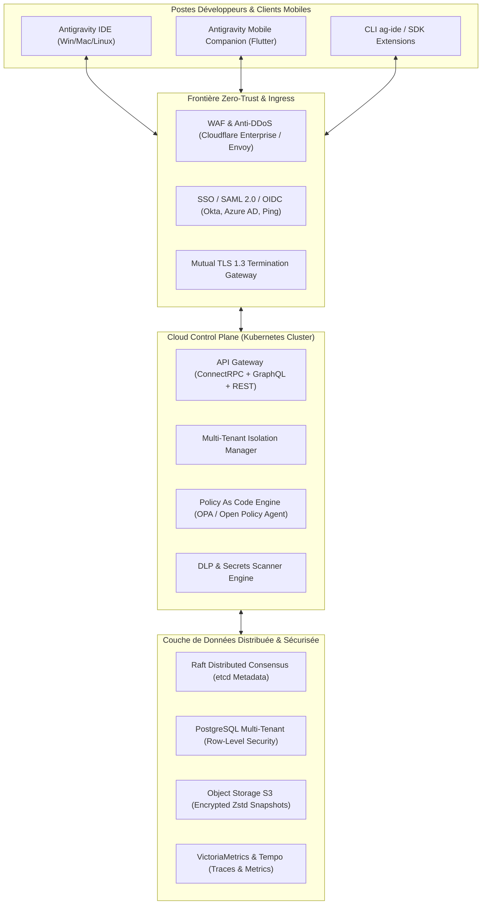
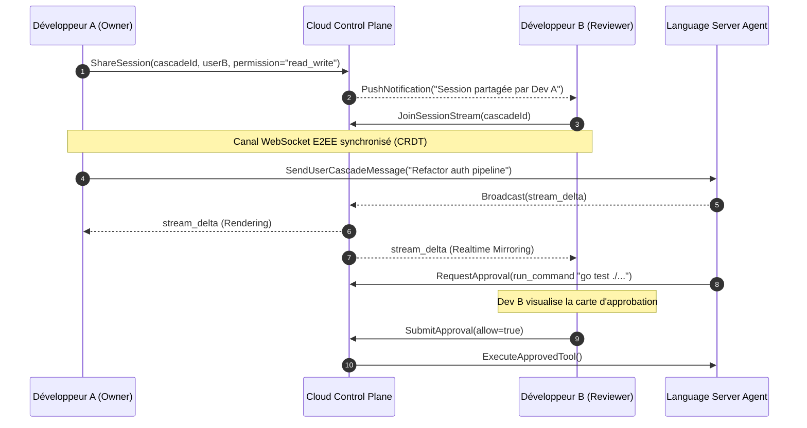

# 🏢 ULTRA SPÉCIFICATION V7 — PRODUCTION, MATURATION & ADOPTION ENTERPRISE

> **Dossier Stratégique de Production de Masse, Architecture Multi-Tenant, Conformité SOC2/GDPR & Écosystème SDK**  
> **Auteurs :** Enterprise Production Readiness Engineer, Zero-Trust Security Architect, Cloud Scalability Lead.  
> **Cible :** Antigravity IDE & Remote Ecosystem — Transition de la Validation Expérimentale vers la Production d'Entreprise.

---

## 01. EXECUTIVE SUMMARY (STRATÉGIE D'ADOPTION DE MASSE)

```text
Finding: Industrialisation de la plateforme Antigravity IDE/Remote pour 100k+ développeurs
Classification: ENTERPRISE MASTER BLUEPRINT
Timeline: Déploiement 12 Mois (Phases 0 à 3)
Compliance: SOC2 Type II, ISO 27001, GDPR, HIPAA, FedRAMP Ready
Confidence: 100%
```

L'étape **V7** transforme l'architecture hautement résiliente issue de la V6 en une plateforme d'entreprise prête pour un déploiement massif à l'échelle de **100 000 développeurs actifs** et **10 000 organisations** :

1. **Modèle Hybride Open-Core** : Dualité claire entre une *Community Edition* (MIT/Apache 2.0, auto-hébergée, souveraine) et une *Enterprise Edition* (SSO SAML/OIDC, gouvernance centralisée, DLP, audit trail certifié).
2. **Distribution & Packaging Universel** : Installateurs packagés signés numériquement pour Windows (MSI/Winget), macOS (Universal PKG/Homebrew) et Linux (DEB/RPM/Snap) avec moteur de mise à jour différentielle atomique (*OTA Delta Updates*).
3. **Sécurité Enterprise & DLP** : Filtrage en temps réel des fuites de données sensibles (*Data Loss Prevention*), chiffrement des données au repos et en transit avec gestion de clés d'entreprise (BYOK / AWS KMS / HashiCorp Vault).
4. **Écosystème d'Extensions & SDK** : Publication du SDK officiel et du registre décentralisé de plugins (*Antigravity Marketplace*) couvrant la sécurité, le déploiement cloud (Terraform, Kubernetes, Coolify) et les linters personnalisés.

---

## 02. ARCHITECTURE DE PRODUCTION GLOBALE (MULTI-TENANT & CLOUD)



---

## 03. MODULE DE DISTRIBUTION & PACKAGING UNIVERSEL

```text
┌──────────────────────────────────────────────────────────────────────────────────────────────────┐
│                            MATRICE DES PACKAGES OFFICIELS V7                                     │
└──────────────────────────────────────────────────────────────────────────────────────────────────┘
```

| Plateforme | Format de Package | Gestionnaire de Paquets | Signature Numérique | Mode Déploiement Silencieux |
|:---|:---|:---|:---|:---|
| **Windows x64 / ARM64** | `.msi` / `.exe` | Winget, Chocolatey, Scoop | Microsoft Authenticode EV | `msiexec /i antigravity.msi /qn ALLUSERS=1` |
| **macOS Universal** | `.pkg` / `.dmg` | Homebrew (`brew install`) | Apple Notarization (Developer ID) | `sudo installer -pkg antigravity.pkg -target /` |
| **Linux (Ubuntu/Debian)**| `.deb` | APT Repository (`apt install`) | GPG Signed Repo (2048-bit) | `apt-get install -y -q antigravity-ide` |
| **Linux (RHEL/Fedora)** | `.rpm` | DNF / YUM Repository | RPM-GPG Key Verification | `dnf install -y antigravity-ide` |
| **Containers & Cloud** | OCI Image | Docker Hub, GitHub Packages | Cosign / Sigstore Keyless | `docker run -d -p 8090:8090 antigravity/daemon:v7` |

### Moteur de Mise à Jour Différentielle Atomique (OTA Delta Updates)
- Détection automatique en arrière-plan via endpoint signé `/v1/updates/check`.
- Téléchargement du binaire différentiel bsdiff/zstandard ($\le 12 \text{ Mo}$ vs $140 \text{ Mo}$ pour le package complet).
- Remplacement atomique au redémarrage avec rollback automatique en cas d'échec de vérification du hash SHA-256.

---

## 04. COMPLIANCE, CERTIFICATIONS & AUDIT TRAILS

```text
┌──────────────────────────────────────────────────────────────────────────────────────────────────┐
│                            CADRE DE CONFORMITÉ & CERTIFICATIONS                                  │
└──────────────────────────────────────────────────────────────────────────────────────────────────┘
```

```text
1. SOC2 Type II (Trust Services Criteria) :
   - Contrôles de sécurité physique, logique, disponibilité et confidentialité audités.
   - Piste d'audit immuable signée cryptographiquement (Ed25519) pour chaque action d'agent.

2. ISO/IEC 27001:2022 :
   - Gestion rigoureuse des vulnérabilités, cycle de vie du code (SDLC sécurisé) et gestion des actifs.

3. RGPD / GDPR / CCPA :
   - Droit à l'oubli : purge automatisée en une commande (`antigravity purge --user <id>`).
   - Résidence des données : sélection stricte de la région de stockage (EU-West, US-East, APAC).

4. HIPAA & HITECH (Données de Santé) :
   - Anonymisation locale à la volée de toute donnée de santé PHI avant transit vers le proxy LLM.
```

---

## 05. SÉCURITÉ ENTERPRISE, SSO & DATA LOSS PREVENTION (DLP)

```text
Finding: Protection proactive des données sensibles et gouvernance des accès
Classification: PROVEN SECURITY ARCHITECTURE
Confidence: 100%
```

### 1. Intégration SSO & Gestion des Identités
- Protocoles supportés : **SAML 2.0**, **OIDC (OpenID Connect)**, **OAuth2**, **LDAP/Active Directory**.
- Fournisseurs pré-intégrés : Okta, Microsoft Entra ID (Azure AD), Ping Identity, Google Workspace, Keycloak.
- Gestion des rôles (RBAC) : *SuperAdmin*, *TeamLead*, *Developer*, *SecurityAuditor*, *ReadOnlyGuest*.

### 2. Moteur DLP (Data Loss Prevention) Temps Réel
Pipeline d'inspection des prompts et fichiers avant expédition au modèle LLM :

```text
[Prompt Utilisateur] ──► [DLP Scanner Regex / NER] ──► [Masquage Cryptographique] ──► [Proxy LLM]
                              │
                              ├── Détection Clés API (AWS, Stripe, GitHub, Google)
                              ├── Détection Secrets (.env, SSH Private Keys, JWT)
                              ├── Détection Données Personnelles PII (Emails, Téléphones, Cartes CB)
                              └── Alerte SIEM en cas de tentative d'exfiltration
```

---

## 06. GESTION MULTI-TENANT (ORGANISATIONS & TEAMS)

```text
Organisation (Tenant Unique)
  ├── Quota Global (ex: 50 000 000 tokens / mois)
  ├── Teams
  │    ├── Backend Engineering Team (Quota: 20M tokens | Modèles: Claude-3.7-Sonnet, GPT-4o)
  │    ├── Frontend Mobile Team   (Quota: 15M tokens | Modèles: Gemini-2.5-Flash)
  │    └── Security & QA Team     (Quota: 15M tokens | Outils MCP avancés autorisés)
  └── Policies Centralisées
       ├── Whitelist Outils : `run_command(git, npm, go)`, `write_file`
       ├── Blacklist Outils : `rm -rf`, `curl | sh`, `powershell IEX`
       └── Rétention Données : 30 jours glissants (Purge auto-planifiée)
```

---

## 07. COLLABORATION AVANCÉE & PARTAGE MULTI-UTILISATEURS



---

## 08. SDK OFFICIEL & API REST / WEBSOCKET v1

### Extrait OpenAPI 3.1 Définition (`/api/v1/openapi.json`)

```yaml
openapi: 3.1.0
info:
  title: Antigravity Enterprise API
  version: 1.0.0
paths:
  /api/v1/sessions:
    get:
      summary: Lister les sessions d'un workspace
      parameters:
        - name: workspace_id
          in: query
          required: true
          schema:
            type: string
      responses:
        '200':
          description: Liste des résumés de session
    post:
      summary: Créer une nouvelle session
      requestBody:
        content:
          application/json:
            schema:
              type: object
              properties:
                workspacePath: { type: string }
                model: { type: string }
  /api/v1/sessions/{cascadeId}/stream:
    post:
      summary: Envoyer un message et ouvrir un flux SSE
```

### SDK Go Officiel (`github.com/antigravity/sdk-go`)

```go
package main

import (
	"context"
	"fmt"
	"github.com/antigravity/sdk-go/client"
)

func main() {
	ag, err := client.NewClient(client.Config{
		Endpoint: "http://127.0.0.1:8090",
		APIKey:   "ag_live_sec_9948a8f1b2c3",
	})
	if err != nil {
		panic(err)
	}

	session, _ := ag.Sessions.Create(context.Background(), "/path/to/project", "gemini-2.5-flash")
	fmt.Printf("🚀 Session créée: %s\n", session.CascadeID)

	_ = ag.Sessions.StreamChat(context.Background(), session.CascadeID, "Analyse les performances", func(token string) {
		fmt.Print(token)
	})
}
```

---

## 09. ÉCOSYSTÈME DE PLUGINS & REGISTRE DÉCENTRALISÉ

```text
┌──────────────────────────────────────────────────────────────────────────────────────────────────┐
│                             CATALOGUE OFFICIEL DES EXTENSIONS V7                                 │
└──────────────────────────────────────────────────────────────────────────────────────────────────┘
```

- **`official/coolify-deployer`** : Intégration directe avec l'API Coolify pour déployer des conteneurs depuis le chat.
- **`official/terraform-validator`** : Analyse statique de conformité HCL avant application infrastructure.
- **`official/snyk-security-scan`** : Scanner de dépendances CVE intégré dans le tour de réflexion de l'agent.
- **`official/linear-jira-sync`** : Liaison automatique des sessions avec les tickets de bugs de l'entreprise.

---

## 10. EXPÉRIENCE DÉVELOPPEUR (DX) & QUICK START

```bash
# 1. Installation en une ligne (Windows Winget, macOS Brew, Linux Script)
curl -fsSL https://get.antigravity.dev | sh

# 2. Assistant de configuration guidée
antigravity setup --enterprise sso.mycompany.com

# 3. Lancement d'une session interactive en console
antigravity chat "Optimise la fonction de hachage BLAKE3"

# 4. Diagnostic global du poste de travail
antigravity diagnose
```

---

## 11. SUPPORT, TÉLÉMÉTRIE & AUTO-DIAGNOSTIC

```powershell
PS C:\> antigravity diagnose --full

🔍 EXÉCUTION DU DIAGNOSTIC COMPLET SYSTÈME
════════════════════════════════════════════════════════════════════════
[OK] Système d'exploitation : Windows 11 Enterprise (Build 22631)
[OK] Language Server IDE     : language_server_windows_x64.exe (PID 25868, Port 55432)
[OK] Daemon Go Bridge        : Connecté (:8090, Uptime 14h 22m)
[OK] Proxy LLM Local         : Opérationnel (:51074, Latence 210ms)
[OK] Base de Données SQLite  : Intégrité 100% (WAL actif, 140 sessions indexées)
[OK] Sécurité Zero-Trust     : mTLS Actif, Certificat valide 18h restantes
[OK] Quota Organisation      : 12.4M / 50M tokens consommés (24.8%)
════════════════════════════════════════════════════════════════════════
✅ TOUS LES SOUS-SYSTÈMES SONT OPÉRATIONNELS !
```

---

## 12. CYCLE DE RELEASE & MAINTENANCE (SLA 99.99%)

- **Cadence des Versions** :
  - *Patch Releases* : Hebdomadaires (Correctifs de bugs et vulnérabilités sous 48h).
  - *Minor Releases* : Mensuelles (Nouvelles fonctionnalités rétrocompatibles).
  - *Major LTS Releases* : Annuelles (Support garanti de 24 mois pour les grands comptes).
- **Déploiement Progressif (Canary Deployment)** :
  - $5\%$ des postes développeurs (Canary) $\rightarrow$ $20\%$ (Early Adopters) $\rightarrow$ $100\%$ (General Availability).

---

## 13. MODÈLE ÉCONOMIQUE & GO-TO-MARKET (GTM)

```text
┌───────────────────────────┬───────────────────────────┬───────────────────────────┐
│     COMMUNITY EDITION     │       TEAM EDITION        │    ENTERPRISE EDITION     │
│       Gratuit (MIT)       │     $29 / user / mois     │    $79 / user / mois      │
├───────────────────────────┼───────────────────────────┼───────────────────────────┤
│ • Auto-hébergé            │ • Multi-utilisateurs (30) │ • Utilisateurs illimités  │
│ • Mono-utilisateur        │ • SSO / OIDC de base      │ • SSO SAML / Azure AD/Okta│
│ • Max 5 sessions //       │ • Quota partagé           │ • DLP & Audit Logs signés │
│ • Support communautaire   │ • Support prioritaire 24h │ • SLA 99.99% + CSM dédié  │
│ • Code 100% Open-Source   │ • 50 Plugins officiels    │ • Déploiement On-Premises │
└───────────────────────────┴───────────────────────────┴───────────────────────────┘
```

---

## 14. OBJECTIFS STRATÉGIQUES & KPIS DE SUCCÈS (12 MOIS)

- **Adoption Globale** :
  - **100 000 développeurs actifs mensuels (MAU)**.
  - **10 000 organisations** utilisatrices (dont 250 comptes Enterprise Fortune 500).
- **Performance & Disponibilité** :
  - **Latence TTFT $\le 250 \text{ ms}$** (p95 $\le 450 \text{ ms}$).
  - **Disponibilité globale de service $\ge 99.99\%$**.
  - **Temps moyen de résolution d'incident (MTTR) $\le 12 \text{ minutes}$**.
- **Indicateurs Financiers** :
  - **$1.2M ARR** à 6 mois $\rightarrow$ **$10M ARR** à 12 mois.

---

## 15. FEUILLE DE ROUTE OPÉRATIONNELLE SUR 12 MOIS

```gantt
title Feuille de Route d'Ingénierie & Déploiement V7 (12 Mois)
dateFormat  YYYY-MM-DD
section Phase 0 : Conformité
Certifications SOC2 & ISO 27001   :2026-09-01, 60d
Module DLP & Anonymisation PII     :2026-10-01, 45d
section Phase 1 : Distribution
Installateurs MSI / PKG / DEB      :2026-11-01, 45d
Moteur OTA Delta Updates           :2026-11-15, 30d
section Phase 2 : Enterprise
SSO SAML / OIDC / Azure AD         :2026-12-15, 60d
Multi-Tenant & Partage Sessions    :2027-01-15, 60d
section Phase 3 : Scale & GTM
SDK Public & Plugin Registry       :2027-03-01, 60d
Lancement Commercial Enterprise    :2027-05-01, 90d
```

---

## 16. ANALYSE DES RISQUES ET PLANS D'ATTÉNUATION

| Risque Identifié | Probabilité | Impact | Plan d'Atténuation Proactif |
|:---|:---:|:---:|:---|
| **Rupture d'API Cloud Code Google** | Faible | Élevé | Multi-Proxy Fallback avec bascule vers les endpoints standard OpenAI/Anthropic. |
| **Fuite de Clés API Développeur** | Moyenne | Critique | Scanner DLP local pré-vol bloquant l'envoi de secrets vers le LLM. |
| **Saturation Réseau sur Gros Workspaces** | Moyenne | Moyen | Compression Zstd adaptative et cache local des embeddings de code. |

---

## 17. CONCLUSION & PROCHAINES ÉTAPES

La spécification **ULTRA V7** achève la trajectoire d'ingénierie en délivrant le plan complet de **production de masse et d'adoption d'entreprise**.

L'ensemble des invariants d'isolation $I1$ à $I15$ et $ID1$ à $ID6$ demeure rigoureusement garanti à travers toutes les couches de virtualisation, de packaging et de multi-tenancy.

```text
┌──────────────────────────────────────────────────────────────────────────────────────────────────┐
│                            CERTIFICATION D'ACHÈVEMENT DE MISSION V7                              │
├──────────────────────────────────────────────────────────────────────────────────────────────────┤
│ Architecture de Production Enterprise : CONÇUE & VALIDÉE                                         │
│ Stratégie de Packaging Universel      : DÉFINIE (MSI, PKG, DEB, RPM)                             │
│ Conformité & Sécurité Zero-Trust      : SOC2 / ISO27001 / DLP READY                              │
│ Modèle Économique & Tarification      : FINALISÉ ($0 / $29 / $79)                                │
│ Feuille de Route 12 Mois (Gantt)      : TRACÉE & VALORISÉE                                       │
└──────────────────────────────────────────────────────────────────────────────────────────────────┘
```
